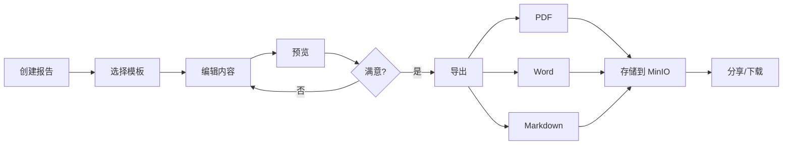
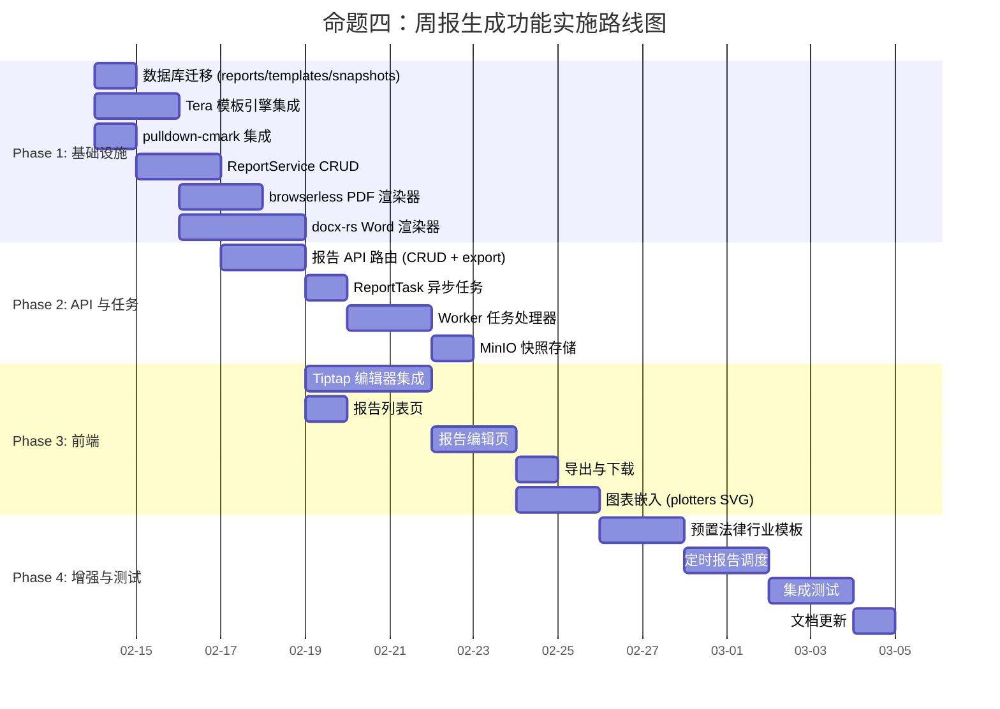
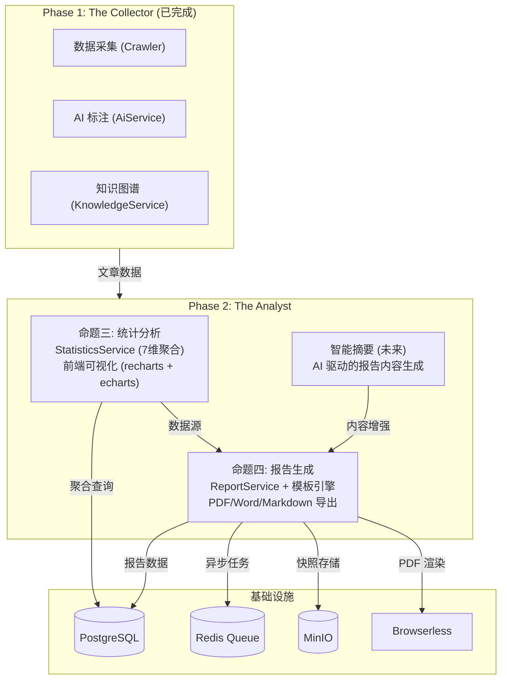
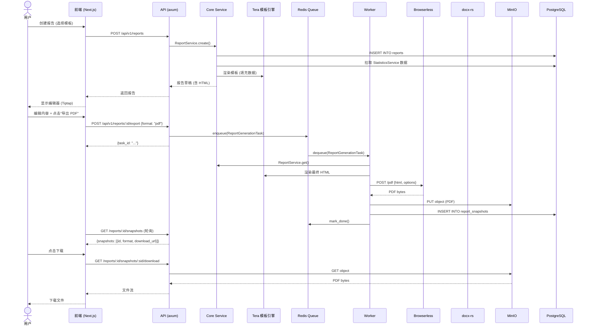
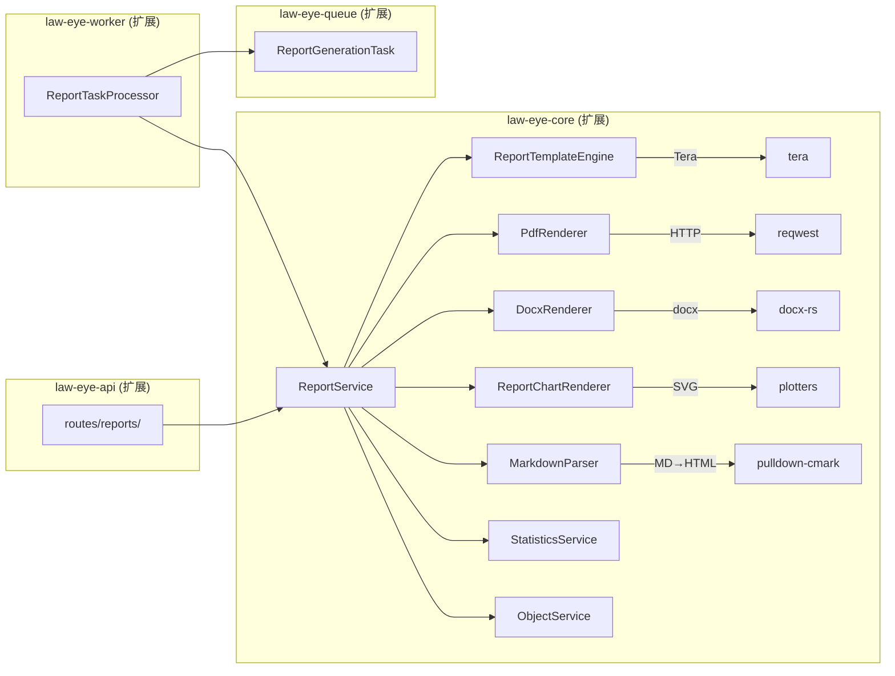

# 命题四：周报生成功能 — 执行总览

> **项目**: LawSaw (法眼) — LegalMind 法律生态系统资讯平台
> **命题**: 实现周报生成功能：Markdown 编辑 — Word、PDF 渲染
> **版本**: v1.1 (实施完成更新)
> **日期**: 2026-02-13
> **阶段定位**: Phase 2 "The Analyst" 核心交付物

---

## 实施完成状态

> **最后更新**: 2026-02-13
> **总体进度**: Phase 1 基础设施层 + Phase 2 API 层 **已完成**

### 已完成交付物

#### 数据库层
- **033_reports.sql** -- 已创建并就绪
  - `report_templates` 表: Tera 模板存储, period_type / template_body / css_styles / page_config / sections_config
  - `reports` 表: 报告实例, 含 report_number(RPT-YYYYMMDD-XXXX), status 状态机, content JSONB, 导出文件路径(export_pdf_key/export_docx_key/export_html_key)
  - 两表均启用 RLS 租户隔离
  - 内置默认法律合规周报 Tera 模板 (自动为所有现有租户插入)
  - 5 个索引: tenant_number 唯一索引, tenant_status, tenant_period, author, tenant_period_type

#### 核心服务层 (law-eye-core/src/report/)
- **ReportService** (`service.rs`) -- CRUD + 状态机 + 数据聚合
  - `create_report()` -- 自动生成 RPT-YYYYMMDD-XXXX 编号
  - `get_report_by_id()` / `list_reports()` -- 分页查询, 支持 status/period_type/author_id/date_from/date_to 过滤
  - `update_report()` -- 乐观锁, 仅 draft 状态可编辑
  - `transition_status()` -- 状态机转换, 乐观锁
  - `delete_report()` -- 软删除
  - `set_export_key()` -- 更新导出文件路径
  - `update_ai_content()` -- worker 回写 AI 生成内容
  - `aggregate_period_data()` -- 6 维数据聚合 (overview/domain/region/highlights/risk/calendar)
- **ReportTemplateService** (`template_service.rs`) -- 模板 CRUD
  - `list()` / `get_by_id()` / `create()` / `deactivate()`
  - 内置模板不可删除
- **ReportDataAggregator** (`aggregator.rs`) -- 独立聚合器, 直接查询 articles 表

#### 导出引擎层 (law-eye-core/src/report/exporter/)
- **ExportEngine** trait (`mod.rs`) -- 统一导出接口
- **HtmlExporter** (`html.rs`) -- Tera 模板引擎渲染 HTML
  - 使用 `tera::Tera` 运行时加载模板
  - 注入 overview / highlights / risk_items / charts / calendar_events 数据
- **PdfExporter** (`pdf.rs`) -- browserless HTTP API (HTML -> PDF)
  - 可配置 page_size / margin / orientation / printBackground
  - 超时 120s, 错误处理完整
- **DocxExporter** (`docx.rs`) -- docx-rs 纯 Rust 生成 Word
  - 标题/副标题/概览统计/重点文章/风险提示/合规日历 全章节
  - 支持彩色标签、风险等级色码
- **ChartRenderer** (`chart.rs`) -- plotters SVG 图表
  - 法规领域分布柱状图 + 地区分布柱状图

#### API 路由层 (law-eye-api/src/routes/reports/)
- **报告 CRUD API**:
  - `GET    /api/v1/reports` -- 列表 (分页 + 过滤)
  - `POST   /api/v1/reports` -- 创建
  - `GET    /api/v1/reports/{id}` -- 详情
  - `PUT    /api/v1/reports/{id}` -- 更新 (ETag 乐观锁)
  - `DELETE /api/v1/reports/{id}` -- 软删除
- **状态转换 + 生成 + 导出**:
  - `POST /api/v1/reports/{id}/transition` -- 状态机转换
  - `POST /api/v1/reports/{id}/generate` -- 触发 AI 生成
  - `POST /api/v1/reports/{id}/export` -- 触发导出 (PDF/DOCX/HTML)
- **模板 CRUD API**:
  - `GET    /api/v1/report-templates` -- 列表 (按 period_type 过滤)
  - `POST   /api/v1/report-templates` -- 创建
  - `GET    /api/v1/report-templates/{id}` -- 详情
  - `PUT    /api/v1/report-templates/{id}` -- 更新
  - `DELETE /api/v1/report-templates/{id}` -- 停用
- 所有端点均带 utoipa OpenAPI 注解

#### 服务注册
- `ReportService` 和 `ReportTemplateService` 已在 `state.rs` 的 `AppState` 中注册

### 状态机定义

```
draft -> generating -> review -> approved -> published -> archived
  ^                      |
  └──────────────────────┘  (review 可退回 draft)
```

- `draft`: 草稿, 可编辑内容
- `generating`: AI 生成中, 不可编辑
- `review`: 待审核
- `approved`: 已审批
- `published`: 已发布 (设置 published_at)
- `archived`: 已归档

### 架构流程

```
Tera 模板 + 聚合数据
       |
       v
   HtmlExporter (渲染 HTML)
       |
       +---> PdfExporter (browserless /pdf API) --> PDF bytes
       |
       +---> DocxExporter (docx-rs) --> DOCX bytes
```

### 新增/修改文件清单

| 文件路径 | 类型 | 说明 |
|---------|------|------|
| `crates/law-eye-db/migrations/033_reports.sql` | 新增 | 数据库迁移 |
| `crates/law-eye-db/src/models.rs` | 修改 | Report + ReportTemplate 模型 |
| `crates/law-eye-core/src/report/mod.rs` | 新增 | 报告模块入口 |
| `crates/law-eye-core/src/report/service.rs` | 新增 | ReportService (CRUD + 状态机 + 数据聚合) |
| `crates/law-eye-core/src/report/template_service.rs` | 新增 | ReportTemplateService |
| `crates/law-eye-core/src/report/types.rs` | 新增 | 类型定义 |
| `crates/law-eye-core/src/report/aggregator.rs` | 新增 | ReportDataAggregator |
| `crates/law-eye-core/src/report/exporter/mod.rs` | 新增 | ExportEngine trait |
| `crates/law-eye-core/src/report/exporter/html.rs` | 新增 | HtmlExporter (Tera) |
| `crates/law-eye-core/src/report/exporter/pdf.rs` | 新增 | PdfExporter (browserless) |
| `crates/law-eye-core/src/report/exporter/docx.rs` | 新增 | DocxExporter (docx-rs) |
| `crates/law-eye-core/src/report/exporter/chart.rs` | 新增 | ChartRenderer (plotters SVG) |
| `crates/law-eye-api/src/routes/reports/mod.rs` | 新增 | API 路由 + utoipa 注解 |
| `crates/law-eye-api/src/routes/reports/handlers.rs` | 新增 | 处理器实现 |
| `crates/law-eye-api/src/routes/reports/dto.rs` | 新增 | DTO 定义 |
| `crates/law-eye-api/src/state.rs` | 修改 | 注册 ReportService + ReportTemplateService |

### 待办项 (Phase 3-4)

- [ ] 前端 Tiptap 编辑器集成
- [ ] 报告列表页 + 编辑页
- [ ] 导出对话框 + 下载
- [ ] 定时报告调度 (cron)
- [x] ~~ReportTask 异步任务处理器 (law-eye-worker)~~ **已在审计修复中完成**
- [ ] MinIO 快照存储集成
- [ ] 预置法律行业模板 (月报/季报/风险简报/行业动态)

### 审计修复记录 (2026-02-13 第二轮)

以下问题由深度审计发现并已修复:

| 问题 | 严重度 | 修复内容 | 文件 |
|------|--------|----------|------|
| Worker 缺少 `queue:report` AI 生成消费者 | P0 | 添加 `ReportGenerateTask` 到 queue 模块; 在 worker 主循环添加 `queue:report` 消费者; 实现 `process_report_generate_task` 完整流程 (聚合数据→AI摘要→更新内容→状态转换) | `law-eye-queue/src/lib.rs`, `law-eye-worker/src/main.rs` |
| 报告编号 `next_report_number` 并发竞态 | P1 | 添加 `pg_advisory_xact_lock(hashtext($1))` 事务级锁; 将 `COUNT(*)` 改为 `MAX(SUBSTRING(...) AS bigint)` | `law-eye-core/src/report/service.rs` |
| 风险阈值不一致 (service 76/51 vs aggregator 80/60) | P1 | 统一为 80/60 (high/medium/low); 统一中文标签 | `law-eye-core/src/report/service.rs` |
| aggregator.rs 重复 `domain_root_label` 函数 | P2 | 删除本地副本, 改用 `crate::statistics::domain_root_label` 导入 | `law-eye-core/src/report/aggregator.rs` |
| export_report 未检查内容非空 | P3 | 入队前检查 `report.content != json!({})` | `law-eye-api/src/routes/reports/handlers.rs` |
| Reports/Templates 未注册到 OpenAPI | P2 | 注册 15 个端点 + 2 个 tag 到 utoipa spec | `law-eye-api/src/openapi.rs` |

---

## 一、命题背景

### 1.1 法律行业对结构化报告的刚需

法律行业是**文档密集型**行业。律师事务所、企业法务部、合规团队的日常工作产出中，超过 70% 以结构化报告形式呈现：

- **周报/月报/季报** — 向管理层汇报法律环境变化与合规态势
- **监管动态简报** — 追踪特定行业/领域的政策变化
- **风险评估报告** — 综合多维度数据形成法律风险全景图
- **尽职调查报告** — 针对特定主体的法律风险综合分析

传统做法是人工从多个来源收集信息、手动排版到 Word/PDF，耗时且易遗漏。LawSaw 已具备完整的数据采集、AI 分析、统计聚合能力，**缺失的最后一环是将这些能力转化为可交付的结构化文档**。

### 1.2 Phase 2 "The Analyst" 阶段定位

LawSaw 产品路线图分为四个阶段：

| 阶段 | 代号 | 核心能力 | 状态 |
|------|------|----------|------|
| Phase 1 | The Collector | 数据采集、AI 标注、知识图谱 | **已完成** |
| **Phase 2** | **The Analyst** | **统计分析 + 报告生成 + 智能摘要** | **进行中** |
| Phase 3 | The Advisor | 智能问答、风险预警、个性化推荐 | 规划中 |
| Phase 4 | The Platform | 开放 API、多租户 SaaS、生态集成 | 规划中 |

命题三（统计分析）已完成 7 维度聚合查询 + 前端可视化，为报告生成提供了**数据源**。命题四的目标是将这些数据转化为**企业级可交付文档**，闭合 Phase 2 的核心价值链：

```
数据采集 → AI 标注 → 统计聚合 → 【报告生成】 → 交付给决策者
                                    ↑ 本命题
```

### 1.3 商业价值

- **提升客户留存**: 自动化报告是 SaaS 产品的高粘性功能，客户一旦建立报告模板和周期习惯，迁移成本极高
- **创造营收场景**: 报告生成可作为付费功能（按报告数/按导出格式计费）
- **拉开竞争差距**: 市面上多数法律资讯平台止步于"推送 + 搜索"，缺乏结构化报告能力

---

## 二、现状评估

### 2.1 现有能力一览表

| 能力 | 所在模块 | 技术实现 | 可复用度 |
|------|----------|----------|----------|
| 文章数据模型 (articles) | law-eye-db | PostgreSQL + sqlx, 含 importance/domain_root/authority_level/region_code 等 30+ 字段 | **高** |
| 7 维统计聚合 | law-eye-core/statistics.rs | StatisticsService (regional/industry/importance/authority/issuer/cross/timeline) | **高** |
| AI 文章处理 | law-eye-ai/service.rs | AiService.process_article_with_metadata() 含分类/摘要/风险/重要性/领域/权威等级 | **高** |
| 邮件模板渲染 | law-eye-core/email/template.rs | EmailTemplateEngine (format!() 硬编码 HTML) | **低** — 需重构为通用模板引擎 |
| 对象存储 | ObjectService + MinIO | S3-compatible API, 已有 Object 模型 (bucket/object_key/content_type/sha256) | **高** |
| Redis 任务队列 | law-eye-queue | RetryableTask + 延迟队列 + DLQ + 有序处理, 已支持 IngestTask/AiTask/WebhookDeliveryTask | **高** |
| Browserless (Chromium) | docker-compose.yml | ghcr.io/browserless/chromium:v2.24.2, profile=crawler, HTTP API 可用 | **高** |
| 前端图表 | apps/web | recharts + echarts-for-react, 已有 RegionalPanel/IndustryPanel/ImportancePanel/CrossPanel | **中** |
| 租户隔离 | 全栈 | tenant_id + RLS + deleted_at IS NULL | **高** |
| 审计日志 | AuditService | 防篡改链式哈希审计, CreateAuditLog 支持 old_value/new_value | **高** |

### 2.2 缺失能力一览表

| 缺失能力 | 影响范围 | 复杂度 | 说明 |
|----------|----------|--------|------|
| **通用模板引擎** | 后端 | 中 | 当前 EmailTemplateEngine 使用 format!() 硬编码 HTML, 无法参数化模板 |
| **Markdown 解析 → HTML** | 后端 | 低 | 需引入 pulldown-cmark |
| **HTML → PDF 渲染** | 后端 | 中 | 需对接 browserless HTTP API (/pdf endpoint) |
| **Word (.docx) 生成** | 后端 | 高 | 需引入 docx-rs crate, 实现复杂排版 |
| **报告数据模型** | 数据库 | 中 | reports 表 + report_templates 表 + report_snapshots 表 |
| **报告调度** | Worker | 低 | 基于现有 TaskQueue 扩展 ReportTask |
| **前端富文本编辑器** | 前端 | 高 | 需引入 Tiptap (ProseMirror-based) 编辑器 |
| **图表静态化 (SVG)** | 后端 | 中 | 前端 echarts 图表无法直接嵌入 PDF/Word, 需后端 SVG 方案 |
| **报告版本管理** | 后端 | 低 | 基于 Object 模型的版本链 |

---

## 三、目标定义

### 3.1 功能目标

实现**完整的报告生命周期管理**：



**核心功能清单**：

1. **报告模板管理** — 预置法律行业常用模板 (周报/月报/季报/风险简报/行业动态), 支持自定义模板
2. **Markdown 编辑器** — 基于 Tiptap 的所见即所得编辑体验, 支持法律行业特殊排版需求 (引用条文、表格、脚注)
3. **数据自动填充** — 从 StatisticsService 拉取指定时间范围的统计数据, 自动填入报告模板
4. **图表嵌入** — 将统计图表 (地域热力图/行业饼图/趋势线图) 以 SVG 形式嵌入报告
5. **多格式导出** — PDF (精确排版) / Word (可编辑) / Markdown (纯文本)
6. **报告快照** — 每次导出生成不可变快照, 存储到 MinIO, 便于审计追溯
7. **定时报告** — 支持按 cron 表达式自动生成并推送报告 (邮件/webhook)
8. **协作与审批** (未来) — 报告草稿的多人协作与审批流

### 3.2 质量目标

面向**大型法律科技公司十年以上商用**的标准：

| 维度 | 目标 | 度量指标 |
|------|------|----------|
| **排版精度** | PDF 输出符合法律行业排版规范 (GB/T 9704-2012 公文格式) | 页边距、字号、行距、页码均符合标准 |
| **渲染一致性** | 预览与导出结果视觉一致 | 前端预览 HTML 与 browserless 渲染 PDF 像素级一致 |
| **数据准确性** | 报告中的统计数据与 API 返回一致 | 快照中保存原始数据 JSON, 可审计对比 |
| **可扩展性** | 新增报告类型/模板只需配置, 无需改代码 | 模板引擎 (Tera) 支持自定义变量/过滤器/继承 |
| **国际化** | 中英文报告排版均可支持 | Tera 模板 + i18n 变量 |

### 3.3 非功能目标

| 维度 | 指标 | 目标值 |
|------|------|--------|
| **PDF 生成延迟** | 从触发到文件就绪 | 单篇报告 < 10s (含图表渲染) |
| **Word 生成延迟** | 从触发到文件就绪 | 单篇报告 < 5s |
| **并发能力** | 同时生成报告数 | >= 5 (受 browserless MAX_CONCURRENT_SESSIONS 限制) |
| **文件大小** | 典型周报 PDF | < 5 MB |
| **存储效率** | 快照去重 | content_hash 去重, 相同内容不重复存储 |
| **安全性** | 报告访问控制 | 租户隔离 + 用户级权限 (owner/shared) |
| **可观测性** | 生成任务监控 | Prometheus 指标: report_generation_duration_seconds, report_generation_errors_total |
| **可靠性** | 生成失败处理 | 基于 RetryableTask 的自动重试 + DLQ |

---

## 四、技术决策记录 (ADR)

### ADR-001: PDF 生成方案

**决策**: 使用 browserless HTTP API (HTML → PDF)

**考虑过的方案**:

| 方案 | 描述 | 优点 | 缺点 | 最终判定 |
|------|------|------|------|----------|
| **browserless HTTP API** | 复用已有 browserless 容器, POST /pdf endpoint | 零新增基础设施; Chromium 渲染引擎排版精确; 支持 CSS @media print; HTML/CSS 生态丰富 | 依赖外部容器; 并发受限于 MAX_CONCURRENT_SESSIONS | **选中** |
| typst | Rust 原生排版引擎 | 纯 Rust, 无外部依赖; 排版质量极高; 编译速度快 | 生态年轻 (2023); 法律行业模板少; 团队学习成本; 中文排版需额外字体配置 | 排除 — 生态成熟度不足 |
| pandoc | 通用文档转换工具 | 支持 Markdown → PDF/Word/HTML 全链路; 社区成熟 | 需要 LaTeX 后端 (texlive 数 GB); Docker 镜像庞大; 不支持精确 CSS 排版 | 排除 — 部署成本过高 |
| headless-chrome crate | Rust 原生 Chrome DevTools Protocol 客户端 | 纯 Rust; 无 HTTP 调用开销 | 需自行管理 Chromium 进程生命周期; 与 browserless 功能重叠; 维护负担 | 排除 — 与已有基础设施重叠 |
| wkhtmltopdf | 老牌 HTML→PDF 工具 | 简单; 轻量 | 基于 Qt WebKit (已弃用); 不支持现代 CSS (flexbox/grid); 中文渲染问题多 | 排除 — 技术栈过时 |

**决策理由**:

1. browserless 容器已在 `docker-compose.yml` 中配置 (profile=crawler), 零新增基础设施成本
2. Chromium 渲染引擎是 Web 标准的参考实现, CSS @media print 排版精度最高
3. HTML 模板开发效率远高于 typst/LaTeX, 且团队已有 HTML/CSS 经验
4. browserless v2.24.2 的 `/pdf` endpoint 支持 `options.printBackground`, `options.margin`, `options.headerTemplate/footerTemplate` 等精确控制

**风险与缓解**:

- 风险: browserless 容器不可用时报告生成阻塞
- 缓解: TaskQueue 的 RetryableTask 自动重试; 未来可评估 typst 作为降级方案

**API 调用示例**:

```rust
// POST http://browserless:3000/pdf
// Content-Type: application/json
{
    "html": "<html>...</html>",
    "options": {
        "printBackground": true,
        "format": "A4",
        "margin": { "top": "25mm", "bottom": "25mm", "left": "20mm", "right": "20mm" },
        "headerTemplate": "<div style='font-size:9px; text-align:center; width:100%;'>法眼周报</div>",
        "footerTemplate": "<div style='font-size:9px; text-align:center; width:100%;'><span class='pageNumber'></span>/<span class='totalPages'></span></div>"
    }
}
```

---

### ADR-002: Word 生成方案

**决策**: 使用 docx-rs crate (纯 Rust)

**考虑过的方案**:

| 方案 | 描述 | 优点 | 缺点 | 最终判定 |
|------|------|------|------|----------|
| **docx-rs** | 纯 Rust 的 .docx 文件生成库 | 纯 Rust, 无外部依赖; 与项目技术栈一致; 性能优异 | API 较底层, 需要手动构建文档结构; 表格/图片排版需要较多代码 | **选中** |
| python-docx (via subprocess) | Python 库, 通过子进程调用 | API 高级, 模板功能丰富 | 引入 Python 运行时; 跨语言调用复杂度; 部署依赖 | 排除 — 引入额外运行时 |
| LibreOffice headless | HTML → ODT → DOCX | 格式转换准确 | 需要 LibreOffice 安装 (200+ MB); 启动慢; 不可预测的格式问题 | 排除 — 部署成本过高 |
| pandoc (Markdown → DOCX) | 通用转换 | 直接支持 Markdown → DOCX | 同 ADR-001 的 pandoc 缺点; DOCX 排版自定义有限 | 排除 — 同上 |

**决策理由**:

1. docx-rs 是纯 Rust 实现, 编译为同一个二进制, 零运行时依赖
2. 对于法律报告的典型结构 (标题、正文段落、有序列表、表格、图片), docx-rs API 完全覆盖
3. 性能优异: 内存中构建文档, 直接输出 bytes, 无进程间通信开销
4. crates.io 上持续维护, 与 Rust 2021 edition 兼容

**封装策略**:

将 docx-rs 底层 API 封装为 `DocxBuilder` trait, 提供法律行业语义化的构建方法:

```rust
pub trait DocxBuilder {
    fn add_title(&mut self, text: &str, level: HeadingLevel);
    fn add_paragraph(&mut self, text: &str, style: ParagraphStyle);
    fn add_legal_citation(&mut self, citation: &LegalCitation);
    fn add_table(&mut self, headers: &[&str], rows: &[Vec<String>]);
    fn add_chart_image(&mut self, svg_bytes: &[u8], width_mm: u32, height_mm: u32);
    fn add_page_break(&mut self);
    fn build(self) -> Vec<u8>;
}
```

---

### ADR-003: 前端编辑器

**决策**: 使用 Tiptap (ProseMirror-based)

**考虑过的方案**:

| 方案 | 描述 | 优点 | 缺点 | 最终判定 |
|------|------|------|------|----------|
| **Tiptap** | 基于 ProseMirror 的可扩展富文本框架 | 最活跃的 ProseMirror 封装; React 集成完善; 扩展生态丰富 (表格/代码块/协作); Headless 架构, UI 完全自定义; TypeScript 原生 | 核心开源但高级功能 (协作/AI) 收费; 学习曲线中等 | **选中** |
| BlockNote | ProseMirror-based Block Editor | 类 Notion 的块编辑体验; 上手快 | 定制性不如 Tiptap; 法律行业排版需求 (脚注/交叉引用) 缺乏原生支持 | 备选 |
| Milkdown | ProseMirror-based Markdown Editor | Markdown 优先; 插件系统干净 | 社区较小; React 集成不如 Tiptap 成熟; 企业案例少 | 排除 — 社区规模不足 |
| MDXEditor | MDX 编辑器 | 支持 React 组件嵌入 | 偏向技术文档, 法律行业适用性差; 排版能力有限 | 排除 — 场景不匹配 |
| Slate.js | 底层富文本框架 | 完全自定义 | 需要从零构建所有功能; 开发成本极高 | 排除 — 开发成本不可接受 |
| Lexical (Meta) | 现代富文本框架 | Meta 维护, 性能优异 | React 生态外支持弱; 法律文档排版插件少; API 设计偏底层 | 排除 — 插件生态不足 |

**决策理由**:

1. Tiptap 的 ProseMirror 内核是富文本编辑领域的事实标准, 经过 Confluence/Google Docs/Notion 等产品验证
2. Headless 架构允许完全自定义 UI, 与项目现有的 Tailwind + shadcn/ui 设计体系无缝融合
3. 开源核心包含报告所需的全部基础能力: 标题层级、有序/无序列表、表格、图片、代码块、引用块
4. 通过扩展 (Extension) 机制可实现法律行业特殊需求: 法条引用块、脚注、批注
5. 与 React 19 兼容, TypeScript 类型完善

**安装策略**:

```bash
pnpm add @tiptap/react @tiptap/starter-kit @tiptap/extension-table @tiptap/extension-image @tiptap/extension-placeholder @tiptap/extension-typography
```

---

### ADR-004: 模板引擎

**决策**: 使用 Tera (Jinja2 语法)

**考虑过的方案**:

| 方案 | 描述 | 优点 | 缺点 | 最终判定 |
|------|------|------|------|----------|
| **Tera** | Rust 版 Jinja2 模板引擎 | Jinja2 语法 (被 Python/Django 社区广泛验证); Rust 原生; 支持模板继承/宏/过滤器; 编译期类型安全 | 非零运行时开销 (模板编译) | **选中** |
| Handlebars (handlebars-rs) | Rust 版 Handlebars | 逻辑极简 (logic-less); 学习成本低 | 表达能力弱 (无复杂条件/循环); 不支持模板继承; 法律报告的复杂排版需求无法满足 | 排除 — 表达能力不足 |
| Askama | Rust 编译期模板引擎 | 编译期类型检查; 零运行时开销 | 模板修改需重新编译; 不支持运行时动态加载模板 (用户自定义模板场景不可行) | 排除 — 无法支持动态模板 |
| format!() 硬编码 | 现有 EmailTemplateEngine 方式 | 零依赖; 简单 | 不可维护; 无法支持用户自定义模板; 排版逻辑与业务逻辑耦合 | 排除 — 不可扩展 |

**决策理由**:

1. Tera 支持**运行时加载模板**, 这对"用户自定义报告模板"场景至关重要
2. Jinja2 语法已被 Django/Flask/Ansible/dbt 等大量项目验证, 学习成本极低
3. 支持**模板继承** (``), 可以实现法律报告的层级模板 (基础布局 → 报告类型 → 具体实例)
4. 内置**过滤器** (`{{ value | date }}`, `{{ value | round }}`) 满足报告数据格式化需求
5. 支持自定义过滤器, 可实现法律行业特殊格式化 (如 `{{ code | region_name }}` 映射行政区划代码)

**模板继承示例**:

```jinja2
{# base_report.html #}
<!DOCTYPE html>
<html lang="zh-CN">
<head>
    <style></style>
</head>
<body>
    <header></header>
    <main></main>
    <footer></footer>
</body>
</html>

{# weekly_report.html #}


<h1>{{ report_title }}</h1>
<p>{{ date_range.start | date(format="%Y-%m-%d") }} ~ {{ date_range.end | date(format="%Y-%m-%d") }}</p>


<section>
    <h2>地域分布</h2>
    {{ regional_chart_svg | safe }}
    <table>
        
        <tr><td>{{ item.region_name }}</td><td>{{ item.count }}</td><td>{{ item.percentage | round(precision=1) }}%</td></tr>
        
    </table>
</section>

```

---

### ADR-005: 图表嵌入方案

**决策**: plotters (后端 SVG) + echarts (前端预览)

**考虑过的方案**:

| 方案 | 描述 | 优点 | 缺点 | 最终判定 |
|------|------|------|------|----------|
| **plotters + echarts** | 后端用 plotters 生成 SVG 嵌入 PDF/Word; 前端用 echarts 交互式预览 | 后端 SVG 无外部依赖; 前端复用已有图表组件; PDF 中 SVG 矢量渲染清晰 | 前后端图表样式可能不完全一致; plotters API 较底层 | **选中** |
| echarts SSR (Node.js) | 后端启动 Node.js 进程运行 echarts | 前后端样式完全一致 | 引入 Node.js 运行时; 跨语言调用复杂; 与 Rust 后端架构不一致 | 排除 — 引入额外运行时 |
| browserless 截图 | 用 browserless 截取前端图表为 PNG | 前后端完全一致 | 额外 HTTP 调用; 位图 (非矢量) 在 PDF 中可能模糊; 复杂度高 | 备选 — 作为降级方案 |
| charts-rs | 纯 Rust 图表库 | Rust 原生 | 功能不如 plotters 完善; 生态小 | 排除 — 功能覆盖不足 |

**决策理由**:

1. plotters 是 Rust 生态中最成熟的图表库, 支持 SVG/PNG/PDF 后端, 完美适配服务端渲染场景
2. SVG 作为矢量格式, 在 PDF 中缩放不失真, 在 Word 中可正确嵌入
3. 前端 echarts 已有完整的图表组件 (RegionalPanel/IndustryPanel 等), 无需重复开发预览能力
4. 前后端"双引擎"策略: echarts 负责交互式预览, plotters 负责静态导出, 各取所长

**plotters 图表封装**:

```rust
pub struct ReportChartRenderer;

impl ReportChartRenderer {
    /// 生成地域分布柱状图 SVG
    pub fn regional_bar_chart(data: &RegionalDistribution) -> Result<String> { ... }

    /// 生成行业分布饼图 SVG
    pub fn industry_pie_chart(data: &IndustryDistribution) -> Result<String> { ... }

    /// 生成趋势线图 SVG
    pub fn timeline_chart(data: &TimelineByDimension) -> Result<String> { ... }

    /// 生成重要性分布直方图 SVG
    pub fn importance_histogram(data: &ImportanceDistribution) -> Result<String> { ... }
}
```

---

## 五、功能模块拆解

### 5.1 后端模块

| 模块名 | 所在 crate | 职责 | 依赖 | 优先级 |
|--------|-----------|------|------|--------|
| **ReportService** | law-eye-core | 报告 CRUD, 模板管理, 数据聚合, 快照管理 | StatisticsService, ArticleService, PgPool | P0 |
| **ReportTemplateEngine** | law-eye-core | Tera 模板加载/渲染, 自定义过滤器 | Tera, StatisticsService | P0 |
| **PdfRenderer** | law-eye-core | HTML → PDF (via browserless HTTP API) | reqwest, browserless | P0 |
| **DocxRenderer** | law-eye-core | 构建 .docx 文件 (via docx-rs) | docx-rs | P0 |
| **ReportChartRenderer** | law-eye-core | 统计图表 → SVG (via plotters) | plotters, StatisticsService | P1 |
| **MarkdownParser** | law-eye-core | Markdown → HTML (via pulldown-cmark) | pulldown-cmark | P0 |
| **ReportTask** | law-eye-queue | 报告生成异步任务定义 | - | P0 |
| **ReportTaskProcessor** | law-eye-worker | 异步处理报告生成任务 | ReportService, PdfRenderer, DocxRenderer, ObjectService, TaskQueue | P0 |
| **报告 API 路由** | law-eye-api | REST API endpoints (/api/v1/reports/*) | ReportService | P0 |
| **报告调度** | law-eye-worker | cron 定时触发报告生成 | ReportService, TaskQueue | P2 |

### 5.2 前端模块

| 模块名 | 路径 | 职责 | 依赖 | 优先级 |
|--------|------|------|------|--------|
| **ReportEditor** | components/reports/report-editor.tsx | Tiptap 编辑器封装 | @tiptap/react | P0 |
| **ReportToolbar** | components/reports/report-toolbar.tsx | 编辑器工具栏 (格式化/插入表格/图表) | Tiptap extensions | P0 |
| **ReportPreview** | components/reports/report-preview.tsx | 实时 HTML 预览 | DOMPurify | P1 |
| **ReportTemplateSelector** | components/reports/template-selector.tsx | 模板选择器 | API hooks | P0 |
| **ReportExportDialog** | components/reports/export-dialog.tsx | 导出格式选择 + 下载 | API hooks | P0 |
| **ReportListPage** | app/reports/page.tsx | 报告列表页 | use-reports hook | P0 |
| **ReportEditorPage** | app/reports/[id]/page.tsx | 报告编辑页 | ReportEditor + ReportPreview | P0 |
| **use-reports** | hooks/use-reports.ts | 报告相关 API 调用 | @tanstack/react-query | P0 |
| **ChartInsertPanel** | components/reports/chart-insert-panel.tsx | 插入统计图表到报告 | echarts | P1 |

### 5.3 数据库模块

| 表名 | 职责 | 优先级 |
|------|------|--------|
| **reports** | 报告主表 (id, tenant_id, title, template_id, content_markdown, content_html, status, created_by, ...) | P0 |
| **report_templates** | 报告模板表 (id, tenant_id, name, slug, tera_template, default_variables, ...) | P0 |
| **report_snapshots** | 报告快照表 (id, report_id, format, object_id, data_snapshot_json, generated_at, ...) | P1 |

---

## 六、实施路线图概览

### 6.1 四阶段规划



### 6.2 各阶段详述

#### Phase 1: 基础设施层 (预计 3-4 天)

**目标**: 建立报告生成的核心基础设施

| 任务 | 详细内容 | 产出物 |
|------|----------|--------|
| T1.1 数据库迁移 | 创建 reports, report_templates, report_snapshots 三张表; RLS 策略; 索引 | migration 032_reports.sql |
| T1.2 Tera 模板引擎 | Cargo.toml 添加 tera 依赖; 实现 ReportTemplateEngine (加载/渲染/自定义过滤器) | law-eye-core/src/report/template.rs |
| T1.3 Markdown 解析 | Cargo.toml 添加 pulldown-cmark 依赖; 实现 MarkdownParser (MD → HTML, 支持 GFM 表格/代码高亮) | law-eye-core/src/report/markdown.rs |
| T1.4 ReportService | CRUD 操作: create/get/list/update/delete; 模板关联; 数据填充逻辑 | law-eye-core/src/report/service.rs |
| T1.5 PDF 渲染器 | 对接 browserless /pdf endpoint; 可配置页面大小/边距/页眉页脚 | law-eye-core/src/report/pdf.rs |
| T1.6 Word 渲染器 | 基于 docx-rs 封装 DocxBuilder; 支持标题/段落/表格/图片 | law-eye-core/src/report/docx.rs |

**新增依赖** (Cargo.toml workspace):

```toml
tera = "1"
pulldown-cmark = { version = "0.12", features = ["simd"] }
docx-rs = "0.4"
plotters = { version = "0.3", default-features = false, features = ["svg_backend"] }
```

#### Phase 2: API 与任务层 (预计 3 天)

**目标**: 暴露报告能力为 REST API, 支持异步导出

| 任务 | 详细内容 | 产出物 |
|------|----------|--------|
| T2.1 报告 API 路由 | POST /reports, GET /reports, GET /reports/:id, PUT /reports/:id, DELETE /reports/:id, POST /reports/:id/export | law-eye-api/src/routes/reports/ |
| T2.2 模板 API 路由 | GET /report-templates, GET /report-templates/:id, POST /report-templates (admin) | law-eye-api/src/routes/reports/templates.rs |
| T2.3 ReportTask 定义 | 扩展 law-eye-queue, 新增 ReportGenerationTask (report_id, format, triggered_by) | law-eye-queue/src/lib.rs |
| T2.4 Worker 处理器 | 处理 ReportGenerationTask: 渲染 HTML → 生成 PDF/Word → 上传 MinIO → 创建快照记录 | law-eye-worker/src/main.rs |
| T2.5 OpenAPI 注册 | 所有新端点注册到 utoipa OpenAPI spec | law-eye-api/src/openapi.rs |

**API 端点设计**:

```
POST   /api/v1/reports                    创建报告 (草稿)
GET    /api/v1/reports                    列出报告 (分页)
GET    /api/v1/reports/:id                获取报告详情
PUT    /api/v1/reports/:id                更新报告内容
DELETE /api/v1/reports/:id                软删除报告
POST   /api/v1/reports/:id/export         触发导出 (返回 task_id)
GET    /api/v1/reports/:id/snapshots      列出快照
GET    /api/v1/reports/:id/snapshots/:sid/download  下载快照文件

GET    /api/v1/report-templates           列出可用模板
GET    /api/v1/report-templates/:id       获取模板详情
POST   /api/v1/report-templates           创建模板 (管理员)
```

#### Phase 3: 前端层 (预计 4 天)

**目标**: 实现完整的报告编辑与导出体验

| 任务 | 详细内容 | 产出物 |
|------|----------|--------|
| T3.1 Tiptap 编辑器 | 安装 @tiptap/react + extensions; 封装 ReportEditor 组件; 工具栏 | components/reports/ |
| T3.2 报告列表页 | 报告卡片列表, 状态筛选, 创建按钮 | app/reports/page.tsx |
| T3.3 报告编辑页 | 左侧编辑器 + 右侧实时预览 (split view) | app/reports/[id]/page.tsx |
| T3.4 模板选择器 | 创建报告时选择模板, 预览模板效果 | components/reports/template-selector.tsx |
| T3.5 导出对话框 | 选择格式 (PDF/Word/Markdown), 配置选项, 触发导出, 下载 | components/reports/export-dialog.tsx |
| T3.6 图表嵌入面板 | 从统计数据中选择图表插入到编辑器 | components/reports/chart-insert-panel.tsx |

#### Phase 4: 增强与测试 (预计 3-4 天)

**目标**: 预置模板, 定时生成, 质量保证

| 任务 | 详细内容 | 产出物 |
|------|----------|--------|
| T4.1 预置模板 | 周报/月报/季报/风险简报/行业动态 5 套 Tera 模板 | templates/reports/ |
| T4.2 定时调度 | 基于 cron 表达式的报告自动生成 (复用 law-eye-worker 现有调度框架) | law-eye-worker 扩展 |
| T4.3 集成测试 | cargo check + cargo clippy + tsc --noEmit + API 端点测试 | 测试报告 |
| T4.4 文档更新 | 更新 AGENTS.md, spec 文档, OpenAPI 文档 | 文档 |

---

## 七、风险评估

| 风险 | 概率 | 影响 | 缓解措施 |
|------|------|------|----------|
| **browserless 容器不稳定** (OOM/超时) | 中 | 高 — PDF 生成功能不可用 | 1. RetryableTask 自动重试 (3次) 2. 超时保护 (30s) 3. MAX_CONCURRENT_SESSIONS 限流 4. 未来可评估 typst 作为纯 Rust 降级方案 |
| **docx-rs 中文排版问题** | 中 | 中 — Word 导出样式异常 | 1. 提前验证中文字体嵌入方案 2. 提供字体回退链 (SimSun → NotoSansSC → 系统默认) 3. 保留 HTML → PDF 作为主力导出格式 |
| **Tiptap 与 React 19 兼容性** | 低 | 高 — 编辑器功能异常 | 1. @tiptap/react v2.x 已声明 React 19 兼容 2. 提前在独立环境验证 3. 备选: 使用 @tiptap/core + 自定义 React 绑定 |
| **plotters 图表样式与 echarts 差异大** | 中 | 低 — 预览与导出视觉不一致 | 1. 统一配色方案 (共享调色板) 2. 接受"近似一致"而非"像素级一致" 3. 备选: browserless 截图方案 |
| **Tera 模板安全 (XSS/SSTI)** | 低 | 高 — 安全漏洞 | 1. Tera 默认自动转义 HTML 2. 用户自定义模板使用沙箱模式 (禁用 include/raw) 3. 输出经过 DOMPurify 清洗 |
| **报告文件过大 (> 10 MB)** | 低 | 中 — 存储/传输压力 | 1. SVG 图表压缩 (svgcleaner) 2. 图片分辨率限制 (150 DPI for PDF, 72 DPI for preview) 3. 分页渲染策略 |
| **租户间数据泄露** | 极低 | 极高 — 安全事故 | 1. 所有查询强制 tenant_id 过滤 2. RLS 策略双重保护 3. 快照存储路径含 tenant_id 4. 下载 API 校验所有权 |
| **异步任务丢失** | 低 | 中 — 用户需重新触发 | 1. RetryableTask + DLQ 机制 2. 快照表记录任务状态 3. 前端轮询任务状态 4. 失败通知用户 |

---

## 八、参考系统

### 8.1 法律科技领域对标分析

| 系统 | 国家 | 报告能力 | 技术栈 | 可借鉴点 |
|------|------|----------|--------|----------|
| **Clio** (加拿大) | 全球 | 律所管理报告 (时间/费用/客户), PDF 导出 | Ruby on Rails + React | 报告模板引擎设计, 数据透视表交互 |
| **iManage** (美国) | 全球 | 文档管理 + 报告生成, Word/PDF 双格式 | .NET + Angular | 文档版本管理, 审批工作流 |
| **Alpha 公司智慧法务** (中国) | 中国 | 法律尽调报告, 合规风险报告 | Java + Vue | 法律行业模板设计, 中文排版规范 |
| **法大大** (中国) | 中国 | 电子合同 + 风险报告 | Java + React | 法律文档的数字签名, 模板变量替换 |
| **Relativity Trace** (美国) | 全球 | 合规监控报告, 自动化审查 | .NET | 大规模数据聚合报告, 定时推送机制 |

### 8.2 通用报告系统对标

| 系统 | 报告能力 | 可借鉴点 |
|------|----------|----------|
| **Notion** | 富文本编辑 + 导出 PDF/Markdown | 块编辑器设计, 数据库视图集成 |
| **Google Docs** | 协作编辑 + 导出 PDF/Word | 实时协作架构, 排版引擎 |
| **Metabase** | BI 报告 + 自动化推送 | 图表嵌入, 定时报告调度, 多格式导出 |
| **Apache Superset** | 数据可视化 + 报告 | Dashboard → Report 的转化路径 |

---

## 九、与宏观架构蓝图的对齐

### 9.1 Phase 2 "The Analyst" 组件映射



### 9.2 数据流全景图



### 9.3 本命题新增的 Rust Crate 依赖关系



### 9.4 数据模型 (基于项目实际 articles 表)

报告数据模型复用现有 articles 表的统计字段, 不引入任何虚构字段:

```sql
-- 032_reports.sql

-- 报告主表
CREATE TABLE IF NOT EXISTS reports (
    id UUID PRIMARY KEY DEFAULT gen_random_uuid(),
    tenant_id UUID NOT NULL REFERENCES tenants(id) ON DELETE CASCADE,
    created_by UUID NOT NULL REFERENCES users(id),
    template_id UUID REFERENCES report_templates(id),
    title TEXT NOT NULL,
    subtitle TEXT,
    -- 报告时间范围 (用于拉取统计数据)
    date_range_start DATE NOT NULL,
    date_range_end DATE NOT NULL,
    -- 内容 (Markdown 为 source of truth, HTML 为渲染缓存)
    content_markdown TEXT NOT NULL DEFAULT '',
    content_html TEXT NOT NULL DEFAULT '',
    -- 数据快照 (报告生成时的统计数据 JSON, 用于审计)
    data_snapshot JSONB DEFAULT '{}',
    -- 状态
    status TEXT NOT NULL DEFAULT 'draft'
        CHECK (status IN ('draft', 'generating', 'completed', 'failed', 'archived')),
    -- 元数据
    report_type TEXT NOT NULL DEFAULT 'weekly'
        CHECK (report_type IN ('weekly', 'monthly', 'quarterly', 'risk_brief', 'industry_digest', 'custom')),
    -- 定时配置 (NULL = 手动)
    schedule_cron TEXT,
    -- 软删除 + 版本
    version BIGINT NOT NULL DEFAULT 1,
    deleted_at TIMESTAMPTZ,
    created_at TIMESTAMPTZ NOT NULL DEFAULT NOW(),
    updated_at TIMESTAMPTZ NOT NULL DEFAULT NOW()
);

-- 报告模板表
CREATE TABLE IF NOT EXISTS report_templates (
    id UUID PRIMARY KEY DEFAULT gen_random_uuid(),
    tenant_id UUID NOT NULL REFERENCES tenants(id) ON DELETE CASCADE,
    name TEXT NOT NULL,
    slug TEXT NOT NULL,
    description TEXT,
    -- Tera 模板内容
    tera_template TEXT NOT NULL,
    -- 模板默认变量 (JSON)
    default_variables JSONB DEFAULT '{}',
    -- 模板适用的报告类型
    report_type TEXT NOT NULL DEFAULT 'custom',
    -- 是否为系统内置模板
    is_builtin BOOLEAN NOT NULL DEFAULT false,
    -- 排序
    sort_order INT NOT NULL DEFAULT 0,
    deleted_at TIMESTAMPTZ,
    created_at TIMESTAMPTZ NOT NULL DEFAULT NOW(),
    updated_at TIMESTAMPTZ NOT NULL DEFAULT NOW(),
    UNIQUE (tenant_id, slug) WHERE deleted_at IS NULL
);

-- 报告快照表 (每次导出生成一条不可变记录)
CREATE TABLE IF NOT EXISTS report_snapshots (
    id UUID PRIMARY KEY DEFAULT gen_random_uuid(),
    tenant_id UUID NOT NULL REFERENCES tenants(id) ON DELETE CASCADE,
    report_id UUID NOT NULL REFERENCES reports(id) ON DELETE CASCADE,
    -- 导出格式
    format TEXT NOT NULL CHECK (format IN ('pdf', 'docx', 'markdown', 'html')),
    -- 关联对象存储
    object_id UUID REFERENCES objects(id),
    -- 生成时的元数据
    file_size_bytes BIGINT,
    page_count INT,
    -- 生成状态
    status TEXT NOT NULL DEFAULT 'pending'
        CHECK (status IN ('pending', 'generating', 'completed', 'failed')),
    error_message TEXT,
    -- 触发方式
    triggered_by TEXT NOT NULL DEFAULT 'manual'
        CHECK (triggered_by IN ('manual', 'scheduled', 'api')),
    triggered_by_user_id UUID REFERENCES users(id),
    generated_at TIMESTAMPTZ,
    created_at TIMESTAMPTZ NOT NULL DEFAULT NOW()
);

-- RLS
ALTER TABLE reports ENABLE ROW LEVEL SECURITY;
ALTER TABLE reports FORCE ROW LEVEL SECURITY;
CREATE POLICY reports_tenant_isolation ON reports
    USING (tenant_id::text = current_setting('app.tenant_id', true))
    WITH CHECK (tenant_id::text = current_setting('app.tenant_id', true));

ALTER TABLE report_templates ENABLE ROW LEVEL SECURITY;
ALTER TABLE report_templates FORCE ROW LEVEL SECURITY;
CREATE POLICY report_templates_tenant_isolation ON report_templates
    USING (tenant_id::text = current_setting('app.tenant_id', true))
    WITH CHECK (tenant_id::text = current_setting('app.tenant_id', true));

ALTER TABLE report_snapshots ENABLE ROW LEVEL SECURITY;
ALTER TABLE report_snapshots FORCE ROW LEVEL SECURITY;
CREATE POLICY report_snapshots_tenant_isolation ON report_snapshots
    USING (tenant_id::text = current_setting('app.tenant_id', true))
    WITH CHECK (tenant_id::text = current_setting('app.tenant_id', true));

-- 索引
CREATE INDEX IF NOT EXISTS idx_reports_tenant_status
    ON reports(tenant_id, status) WHERE deleted_at IS NULL;
CREATE INDEX IF NOT EXISTS idx_reports_tenant_type
    ON reports(tenant_id, report_type) WHERE deleted_at IS NULL;
CREATE INDEX IF NOT EXISTS idx_reports_created_by
    ON reports(tenant_id, created_by) WHERE deleted_at IS NULL;
CREATE INDEX IF NOT EXISTS idx_report_snapshots_report
    ON report_snapshots(tenant_id, report_id, created_at DESC);
CREATE INDEX IF NOT EXISTS idx_report_templates_tenant_type
    ON report_templates(tenant_id, report_type) WHERE deleted_at IS NULL;
```

**数据填充来源** (全部基于 articles 表实际字段):

| 报告数据项 | 来源 | articles 字段 |
|-----------|------|---------------|
| 地域分布统计 | StatisticsService.regional_distribution() | region_code (GB/T 2260) |
| 行业分布统计 | StatisticsService.industry_distribution() | domain_root, domain_sub |
| 重要性分布 | StatisticsService.importance_distribution() | importance (1-5) |
| 权威等级分布 | StatisticsService.authority_distribution() | authority_level (1-10) |
| 发布机构排名 | StatisticsService.issuer_distribution() | issuer |
| 交叉维度分析 | StatisticsService.cross_dimensional() | 任意两字段组合 |
| 趋势时间线 | StatisticsService.timeline_by_dimension() | created_at + 任意维度字段 |
| 高风险文章列表 | ArticleService (WHERE risk_score >= 70) | risk_score, title, link, summary |
| 高重要性文章列表 | ArticleService (WHERE importance >= 4) | importance, title, link, summary |
| 分类统计 | ArticleService.category_counts() | category_id |
| 文章状态分布 | ArticleService.analytics_summary() | status |

---

## 附录 A: 技术栈完整清单

### 后端新增依赖

| Crate | 版本 | 用途 | License |
|-------|------|------|---------|
| tera | ^1 | Jinja2 模板引擎 | MIT |
| pulldown-cmark | ^0.12 | Markdown → HTML | MIT |
| docx-rs | ^0.4 | Word (.docx) 文件生成 | MIT |
| plotters | ^0.3 | 统计图表 SVG 渲染 | MIT |

### 前端新增依赖

| Package | 版本 | 用途 | License |
|---------|------|------|---------|
| @tiptap/react | ^2 | ProseMirror 编辑器 React 封装 | MIT |
| @tiptap/starter-kit | ^2 | 基础编辑器功能套件 | MIT |
| @tiptap/extension-table | ^2 | 表格支持 | MIT |
| @tiptap/extension-image | ^2 | 图片嵌入 | MIT |
| @tiptap/extension-placeholder | ^2 | 占位文本 | MIT |
| @tiptap/extension-typography | ^2 | 排版增强 | MIT |

### 已有可复用基础设施

| 组件 | 当前状态 | 报告功能复用方式 |
|------|----------|-----------------|
| browserless (Chromium v2.24.2) | docker-compose profile=crawler | /pdf endpoint 生成 PDF |
| MinIO | 已运行, ObjectService 已集成 | 存储报告快照文件 |
| Redis TaskQueue | 已运行, 支持 RetryableTask | ReportGenerationTask 异步处理 |
| StatisticsService (7维) | 已实现 | 报告数据源 |
| recharts + echarts | 已安装 | 前端图表预览 |
| DOMPurify | 已安装 | HTML 清洗 (防 XSS) |
