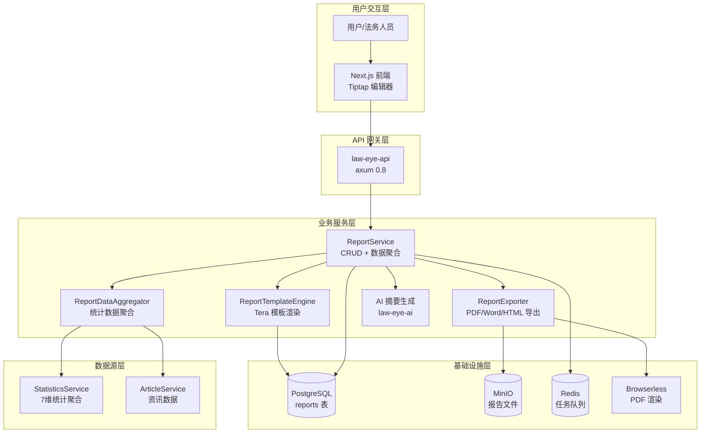
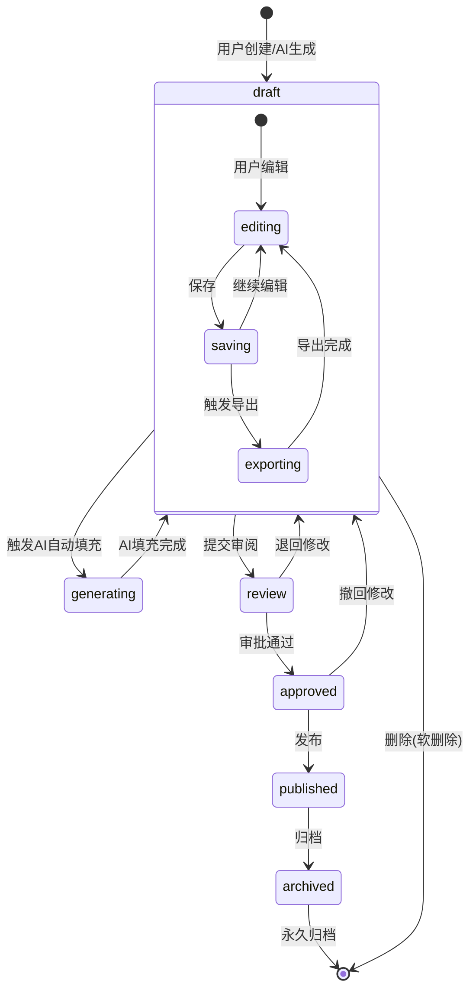
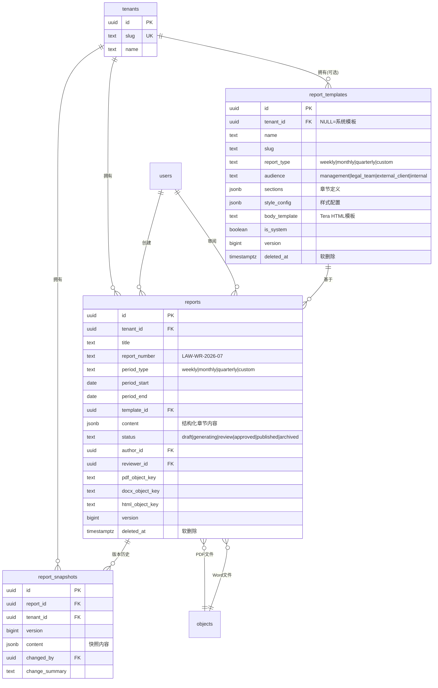
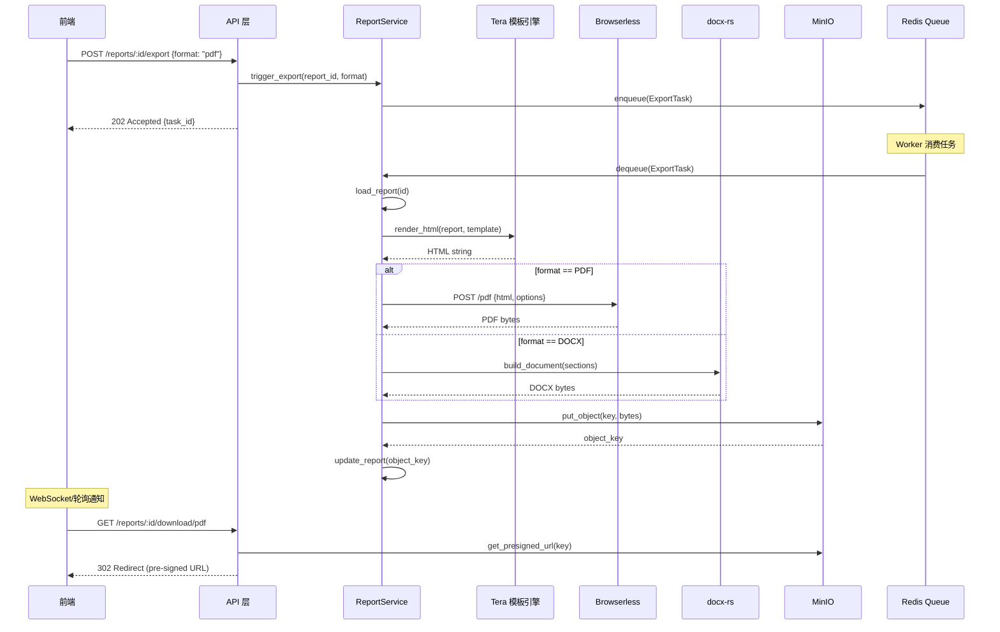

# 命题四：周报生成功能 — 整体架构设计

> 文档编号: RPT-ARCH-002
> 版本: 1.0
> 更新日期: 2026-02-13
> 状态: 设计评审中

---

## 一、架构总览

### 1.1 系统上下文图



### 1.2 报告生命周期流程



### 1.3 关键设计原则

| 原则 | 说明 | 实现策略 |
|:-----|:-----|:---------|
| **结构化内容** | 报告内容按章节独立存储，而非扁平文本 | JSONB `content` 字段，每个章节独立编辑 |
| **模板驱动** | 报告结构由模板定义，内容可自动/手动填充 | `report_templates.sections` 定义章节结构 |
| **租户隔离** | 所有报告数据严格按租户隔离 | RLS 策略 + `tenant_id` 外键 |
| **乐观并发** | 多用户编辑不丢失数据 | `version` 字段 + `If-Match` ETag |
| **异步导出** | PDF/Word 生成可能耗时，不阻塞请求 | Redis 任务队列 + WebSocket 通知 |
| **版本追踪** | 每次保存留快照，支持审计追溯 | `report_snapshots` 表 |

---

## 二、数据库模型设计

### 2.1 E-R 关系图



### 2.2 DDL: Migration 032_reports.sql

```sql
-- 032_reports.sql
-- 报告生成系统：模板 + 报告 + 快照

-- ═══════════════════════════════════════════════════════════════
-- 1. 报告模板表 (report_templates)
-- ═══════════════════════════════════════════════════════════════

CREATE TABLE report_templates (
    id UUID PRIMARY KEY DEFAULT gen_random_uuid(),
    tenant_id UUID REFERENCES tenants(id) ON DELETE CASCADE,
    -- tenant_id 为 NULL 表示系统内置模板，所有租户可见

    name TEXT NOT NULL,
    description TEXT,
    slug TEXT NOT NULL,

    -- 报告类型
    report_type TEXT NOT NULL CHECK (report_type IN (
        'weekly', 'monthly', 'quarterly', 'custom'
    )),

    -- 目标受众
    audience TEXT NOT NULL DEFAULT 'internal' CHECK (audience IN (
        'management', 'legal_team', 'external_client', 'internal'
    )),

    -- 模板章节结构 (JSON Schema)
    -- 每个章节定义：id, type, title, auto_fill, data_source, order
    sections JSONB NOT NULL DEFAULT '[]'::jsonb,

    -- 样式配置 (PDF/Word 渲染参数)
    style_config JSONB NOT NULL DEFAULT '{
        "paper_size": "A4",
        "margin": {"top_mm": 25, "bottom_mm": 25, "left_mm": 30, "right_mm": 25},
        "font_family": "SimSun",
        "title_font_size_pt": 18,
        "body_font_size_pt": 12,
        "line_spacing": 1.5,
        "header": {"show_logo": true, "text": "", "classification": "内部资料"},
        "footer": {"text": "仅供内部参考", "show_page_number": true, "show_date": true}
    }'::jsonb,

    -- HTML 模板 (Tera 语法, {{ variable }})
    body_template TEXT,

    is_system BOOLEAN NOT NULL DEFAULT false,

    created_at TIMESTAMPTZ NOT NULL DEFAULT NOW(),
    updated_at TIMESTAMPTZ NOT NULL DEFAULT NOW(),
    deleted_at TIMESTAMPTZ,
    version BIGINT NOT NULL DEFAULT 1,

    -- 同租户下 slug 唯一（软删除记录除外）
    CONSTRAINT report_templates_tenant_slug_unique
        UNIQUE NULLS NOT DISTINCT (tenant_id, slug, deleted_at)
);

COMMENT ON TABLE report_templates IS '报告模板定义：系统模板(tenant_id=NULL)和租户私有模板';
COMMENT ON COLUMN report_templates.sections IS '章节结构JSON数组，每项含: id, type(cover|text|articles|charts|calendar|risk|static), title, auto_fill, data_source, order';
COMMENT ON COLUMN report_templates.style_config IS 'PDF/Word渲染样式参数: 纸张大小、页边距、字体、页眉页脚等';

-- ═══════════════════════════════════════════════════════════════
-- 2. 报告表 (reports)
-- ═══════════════════════════════════════════════════════════════

CREATE TABLE reports (
    id UUID PRIMARY KEY DEFAULT gen_random_uuid(),
    tenant_id UUID NOT NULL DEFAULT current_setting('app.tenant_id')::uuid,

    -- 基本信息
    title TEXT NOT NULL,
    report_number TEXT, -- 编号: LAW-WR-2026-W07 (自动生成)

    -- 报告期间
    period_type TEXT NOT NULL CHECK (period_type IN (
        'weekly', 'monthly', 'quarterly', 'custom'
    )),
    period_start DATE NOT NULL,
    period_end DATE NOT NULL,
    CHECK (period_end >= period_start),

    -- 关联模板
    template_id UUID REFERENCES report_templates(id) ON DELETE SET NULL,

    -- 结构化内容 (JSONB)
    -- {
    --   "sections": {
    --     "cover": { "title": "...", "subtitle": "...", "period": "..." },
    --     "executive_summary": { "markdown": "...", "html": "..." },
    --     "legislation": { "articles": [...], "markdown": "..." },
    --     "statistics": { "charts": [...], "markdown": "..." },
    --     ...
    --   },
    --   "metadata": {
    --     "generated_by": "system|user",
    --     "ai_model": "gpt-4o",
    --     "generation_params": {...}
    --   }
    -- }
    content JSONB NOT NULL DEFAULT '{}'::jsonb,

    -- 状态流转
    status TEXT NOT NULL DEFAULT 'draft' CHECK (status IN (
        'draft',        -- 草稿 (可编辑)
        'generating',   -- AI 生成中 (锁定)
        'review',       -- 待审阅
        'approved',     -- 已审批
        'published',    -- 已发布
        'archived'      -- 已归档
    )),

    -- 作者与审批
    author_id UUID NOT NULL,
    reviewer_id UUID,
    approved_at TIMESTAMPTZ,
    published_at TIMESTAMPTZ,

    -- 导出文件引用 (MinIO object keys)
    pdf_object_key TEXT,   -- reports/{tenant_id}/{id}/v{version}.pdf
    docx_object_key TEXT,  -- reports/{tenant_id}/{id}/v{version}.docx
    html_object_key TEXT,  -- reports/{tenant_id}/{id}/v{version}.html

    -- 系统字段
    created_at TIMESTAMPTZ NOT NULL DEFAULT NOW(),
    updated_at TIMESTAMPTZ NOT NULL DEFAULT NOW(),
    deleted_at TIMESTAMPTZ,
    version BIGINT NOT NULL DEFAULT 1,

    -- 外键约束
    CONSTRAINT reports_tenant_fkey
        FOREIGN KEY (tenant_id) REFERENCES tenants(id) ON DELETE CASCADE,
    CONSTRAINT reports_author_tenant_fkey
        FOREIGN KEY (tenant_id, author_id) REFERENCES users(tenant_id, id) ON DELETE RESTRICT,
    CONSTRAINT reports_reviewer_tenant_fkey
        FOREIGN KEY (tenant_id, reviewer_id) REFERENCES users(tenant_id, id) ON DELETE SET NULL
);

COMMENT ON TABLE reports IS '报告实例：每份生成的周报/月报/季报/自定义报告';
COMMENT ON COLUMN reports.content IS '结构化章节内容(JSONB)：每个章节独立存储Markdown+HTML+数据';
COMMENT ON COLUMN reports.report_number IS '报告编号(自动生成): LAW-WR-2026-W07 (周报), LAW-MR-2026-02 (月报)';

-- ═══════════════════════════════════════════════════════════════
-- 3. 报告快照表 (report_snapshots)
-- ═══════════════════════════════════════════════════════════════

CREATE TABLE report_snapshots (
    id UUID PRIMARY KEY DEFAULT gen_random_uuid(),
    report_id UUID NOT NULL,
    tenant_id UUID NOT NULL DEFAULT current_setting('app.tenant_id')::uuid,

    snapshot_version BIGINT NOT NULL, -- 对应 reports.version 时刻的值
    content JSONB NOT NULL,           -- 完整 content 快照
    changed_by UUID NOT NULL,
    change_summary TEXT,              -- 变更摘要 (手动或自动生成)

    created_at TIMESTAMPTZ NOT NULL DEFAULT NOW(),

    -- 外键
    CONSTRAINT report_snapshots_report_fkey
        FOREIGN KEY (report_id) REFERENCES reports(id) ON DELETE CASCADE,
    CONSTRAINT report_snapshots_tenant_fkey
        FOREIGN KEY (tenant_id) REFERENCES tenants(id) ON DELETE CASCADE,
    CONSTRAINT report_snapshots_changed_by_tenant_fkey
        FOREIGN KEY (tenant_id, changed_by) REFERENCES users(tenant_id, id) ON DELETE SET NULL,

    -- 每份报告每个版本只有一个快照
    CONSTRAINT report_snapshots_report_version_unique
        UNIQUE (report_id, snapshot_version)
);

COMMENT ON TABLE report_snapshots IS '报告版本快照：每次保存创建一个不可变快照，用于审计追溯';

-- ═══════════════════════════════════════════════════════════════
-- 4. 索引
-- ═══════════════════════════════════════════════════════════════

-- 报告模板
CREATE INDEX idx_report_templates_tenant
    ON report_templates(tenant_id)
    WHERE deleted_at IS NULL;

CREATE INDEX idx_report_templates_system
    ON report_templates(is_system)
    WHERE is_system = true AND deleted_at IS NULL;

CREATE INDEX idx_report_templates_type
    ON report_templates(report_type)
    WHERE deleted_at IS NULL;

-- 报告
CREATE INDEX idx_reports_tenant_status
    ON reports(tenant_id, status)
    WHERE deleted_at IS NULL;

CREATE INDEX idx_reports_tenant_period
    ON reports(tenant_id, period_start DESC, period_end DESC)
    WHERE deleted_at IS NULL;

CREATE INDEX idx_reports_tenant_type
    ON reports(tenant_id, period_type)
    WHERE deleted_at IS NULL;

CREATE INDEX idx_reports_template
    ON reports(template_id)
    WHERE deleted_at IS NULL;

CREATE INDEX idx_reports_author
    ON reports(tenant_id, author_id)
    WHERE deleted_at IS NULL;

CREATE INDEX idx_reports_tenant_deleted
    ON reports(tenant_id, deleted_at);

-- 快照
CREATE INDEX idx_report_snapshots_report
    ON report_snapshots(report_id, snapshot_version DESC);

CREATE INDEX idx_report_snapshots_tenant
    ON report_snapshots(tenant_id);

-- ═══════════════════════════════════════════════════════════════
-- 5. 触发器
-- ═══════════════════════════════════════════════════════════════

CREATE TRIGGER update_report_templates_updated_at
    BEFORE UPDATE ON report_templates
    FOR EACH ROW
    EXECUTE FUNCTION update_updated_at_column();

CREATE TRIGGER update_reports_updated_at
    BEFORE UPDATE ON reports
    FOR EACH ROW
    EXECUTE FUNCTION update_updated_at_column();

CREATE TRIGGER update_reports_version
    BEFORE UPDATE ON reports
    FOR EACH ROW
    EXECUTE FUNCTION bump_version_column();

CREATE TRIGGER update_report_templates_version
    BEFORE UPDATE ON report_templates
    FOR EACH ROW
    EXECUTE FUNCTION bump_version_column();

-- ═══════════════════════════════════════════════════════════════
-- 6. RLS 策略
-- ═══════════════════════════════════════════════════════════════

-- report_templates: 系统模板(tenant_id IS NULL)对所有租户可见
ALTER TABLE report_templates ENABLE ROW LEVEL SECURITY;
ALTER TABLE report_templates FORCE ROW LEVEL SECURITY;

CREATE POLICY report_templates_tenant_isolation
    ON report_templates
    USING (
        tenant_id IS NULL  -- 系统模板对所有租户可见
        OR tenant_id::text = current_setting('app.tenant_id', true)
    )
    WITH CHECK (
        tenant_id IS NULL
        OR tenant_id::text = current_setting('app.tenant_id', true)
    );

-- reports: 严格租户隔离
ALTER TABLE reports ENABLE ROW LEVEL SECURITY;
ALTER TABLE reports FORCE ROW LEVEL SECURITY;

CREATE POLICY reports_tenant_isolation
    ON reports
    USING (tenant_id::text = current_setting('app.tenant_id', true))
    WITH CHECK (tenant_id::text = current_setting('app.tenant_id', true));

-- report_snapshots: 严格租户隔离
ALTER TABLE report_snapshots ENABLE ROW LEVEL SECURITY;
ALTER TABLE report_snapshots FORCE ROW LEVEL SECURITY;

CREATE POLICY report_snapshots_tenant_isolation
    ON report_snapshots
    USING (tenant_id::text = current_setting('app.tenant_id', true))
    WITH CHECK (tenant_id::text = current_setting('app.tenant_id', true));

-- ═══════════════════════════════════════════════════════════════
-- 7. 权限授予
-- ═══════════════════════════════════════════════════════════════

GRANT SELECT, INSERT, UPDATE ON report_templates TO law_eye_app;
GRANT SELECT, INSERT, UPDATE ON reports TO law_eye_app;
GRANT SELECT, INSERT ON report_snapshots TO law_eye_app;

-- ═══════════════════════════════════════════════════════════════
-- 8. 系统内置模板 (Seed Data)
-- ═══════════════════════════════════════════════════════════════

INSERT INTO report_templates (
    tenant_id, name, slug, report_type, audience, is_system,
    description, sections, style_config, body_template
) VALUES
-- 法律合规周报模板
(
    NULL,
    '法律合规周报',
    'weekly-compliance',
    'weekly',
    'internal',
    true,
    '标准法律合规周报模板，包含立法动态、监管动向、执法案例、数据统计等章节',
    '[
        {"id": "cover", "type": "cover", "title": "封面", "order": 1, "auto_fill": true, "data_source": "report_meta"},
        {"id": "toc", "type": "toc", "title": "目录", "order": 2, "auto_fill": true, "data_source": null},
        {"id": "executive_summary", "type": "text", "title": "执行摘要", "order": 3, "auto_fill": true, "data_source": "ai_summary"},
        {"id": "legislation", "type": "articles", "title": "立法动态", "order": 4, "auto_fill": true, "data_source": "domain:legislation"},
        {"id": "regulation", "type": "articles", "title": "监管动向", "order": 5, "auto_fill": true, "data_source": "domain:regulation"},
        {"id": "enforcement", "type": "articles", "title": "执法案例", "order": 6, "auto_fill": true, "data_source": "domain:enforcement"},
        {"id": "industry", "type": "articles", "title": "行业动态", "order": 7, "auto_fill": true, "data_source": "domain:industry"},
        {"id": "statistics", "type": "charts", "title": "数据统计与分析", "order": 8, "auto_fill": true, "data_source": "statistics"},
        {"id": "risk_alerts", "type": "risk", "title": "风险预警", "order": 9, "auto_fill": true, "data_source": "high_risk"},
        {"id": "calendar", "type": "calendar", "title": "合规日历", "order": 10, "auto_fill": true, "data_source": "upcoming_regulations"},
        {"id": "international", "type": "articles", "title": "国际视野", "order": 11, "auto_fill": true, "data_source": "domain:international"},
        {"id": "disclaimer", "type": "static", "title": "免责声明", "order": 12, "auto_fill": false, "content": "本报告所载信息仅供参考，不构成法律意见。如需法律咨询，请联系专业律师。"}
    ]'::jsonb,
    '{
        "paper_size": "A4",
        "margin": {"top_mm": 25, "bottom_mm": 25, "left_mm": 30, "right_mm": 25},
        "font_family": "SimSun",
        "title_font_size_pt": 22,
        "h1_font_size_pt": 18,
        "h2_font_size_pt": 16,
        "h3_font_size_pt": 14,
        "body_font_size_pt": 12,
        "line_spacing": 1.5,
        "header": {"show_logo": true, "text": "法眼合规周报", "classification": "内部资料"},
        "footer": {"text": "© LegalMind. 仅供内部参考", "show_page_number": true, "show_date": true},
        "cover": {"show_logo": true, "show_period": true, "show_org_name": true, "bg_color": "#1a365d"}
    }'::jsonb,
    NULL -- body_template 将在实施阶段填入完整 Tera HTML 模板
),
-- 月度合规报告模板
(
    NULL,
    '月度合规报告',
    'monthly-compliance',
    'monthly',
    'management',
    true,
    '面向管理层的月度合规综合报告，包含趋势分析和深度解读',
    '[
        {"id": "cover", "type": "cover", "title": "封面", "order": 1, "auto_fill": true, "data_source": "report_meta"},
        {"id": "toc", "type": "toc", "title": "目录", "order": 2, "auto_fill": true, "data_source": null},
        {"id": "executive_summary", "type": "text", "title": "执行摘要", "order": 3, "auto_fill": true, "data_source": "ai_summary"},
        {"id": "overview", "type": "charts", "title": "本月概览", "order": 4, "auto_fill": true, "data_source": "statistics_overview"},
        {"id": "legislation", "type": "articles", "title": "重点立法动态", "order": 5, "auto_fill": true, "data_source": "domain:legislation:importance>=4"},
        {"id": "regulation", "type": "articles", "title": "重要监管动向", "order": 6, "auto_fill": true, "data_source": "domain:regulation:importance>=4"},
        {"id": "enforcement", "type": "articles", "title": "典型执法案例", "order": 7, "auto_fill": true, "data_source": "domain:enforcement:importance>=3"},
        {"id": "trend_analysis", "type": "charts", "title": "趋势分析", "order": 8, "auto_fill": true, "data_source": "statistics_timeline"},
        {"id": "regional_analysis", "type": "charts", "title": "地域分布分析", "order": 9, "auto_fill": true, "data_source": "statistics_regional"},
        {"id": "industry_analysis", "type": "charts", "title": "行业分布分析", "order": 10, "auto_fill": true, "data_source": "statistics_industry"},
        {"id": "risk_assessment", "type": "risk", "title": "风险评估与预警", "order": 11, "auto_fill": true, "data_source": "high_risk"},
        {"id": "recommendations", "type": "text", "title": "合规建议", "order": 12, "auto_fill": true, "data_source": "ai_recommendations"},
        {"id": "appendix", "type": "static", "title": "附录", "order": 13, "auto_fill": false, "content": ""},
        {"id": "disclaimer", "type": "static", "title": "免责声明", "order": 14, "auto_fill": false, "content": "本报告所载信息仅供参考，不构成法律意见。"}
    ]'::jsonb,
    '{
        "paper_size": "A4",
        "margin": {"top_mm": 25, "bottom_mm": 25, "left_mm": 30, "right_mm": 25},
        "font_family": "SimSun",
        "title_font_size_pt": 24,
        "h1_font_size_pt": 18,
        "h2_font_size_pt": 16,
        "h3_font_size_pt": 14,
        "body_font_size_pt": 12,
        "line_spacing": 1.5,
        "header": {"show_logo": true, "text": "法眼月度合规报告", "classification": "内部机密"},
        "footer": {"text": "© LegalMind. 内部机密 — 未经授权禁止传播", "show_page_number": true, "show_date": true},
        "cover": {"show_logo": true, "show_period": true, "show_org_name": true, "bg_color": "#1a365d"}
    }'::jsonb,
    NULL
),
-- 行业专题报告模板
(
    NULL,
    '行业专题报告',
    'industry-special',
    'custom',
    'external_client',
    true,
    '面向外部客户的行业专题深度分析报告',
    '[
        {"id": "cover", "type": "cover", "title": "封面", "order": 1, "auto_fill": true, "data_source": "report_meta"},
        {"id": "toc", "type": "toc", "title": "目录", "order": 2, "auto_fill": true, "data_source": null},
        {"id": "executive_summary", "type": "text", "title": "报告摘要", "order": 3, "auto_fill": true, "data_source": "ai_summary"},
        {"id": "background", "type": "text", "title": "行业背景", "order": 4, "auto_fill": false},
        {"id": "regulatory_landscape", "type": "articles", "title": "监管格局", "order": 5, "auto_fill": true, "data_source": "domain:regulation"},
        {"id": "key_developments", "type": "articles", "title": "重要事件", "order": 6, "auto_fill": true, "data_source": "domain:industry"},
        {"id": "data_analysis", "type": "charts", "title": "数据分析", "order": 7, "auto_fill": true, "data_source": "statistics"},
        {"id": "outlook", "type": "text", "title": "展望与建议", "order": 8, "auto_fill": true, "data_source": "ai_recommendations"},
        {"id": "appendix", "type": "static", "title": "附录", "order": 9, "auto_fill": false},
        {"id": "disclaimer", "type": "static", "title": "免责声明", "order": 10, "auto_fill": false, "content": "本报告所载信息仅供参考，不构成法律意见。如需法律咨询，请联系专业律师。所有统计数据基于公开信息整理。"}
    ]'::jsonb,
    '{
        "paper_size": "A4",
        "margin": {"top_mm": 25, "bottom_mm": 25, "left_mm": 30, "right_mm": 25},
        "font_family": "SimSun",
        "title_font_size_pt": 26,
        "h1_font_size_pt": 20,
        "h2_font_size_pt": 16,
        "h3_font_size_pt": 14,
        "body_font_size_pt": 12,
        "line_spacing": 1.5,
        "header": {"show_logo": true, "text": "", "classification": ""},
        "footer": {"text": "© LegalMind. 版权所有", "show_page_number": true, "show_date": true},
        "cover": {"show_logo": true, "show_period": true, "show_org_name": true, "bg_color": "#2c5282"}
    }'::jsonb,
    NULL
)
ON CONFLICT DO NOTHING;
```

### 2.3 数据模型设计决策说明

#### 2.3.1 `content` JSONB 字段结构

选择 JSONB 而非多个 TEXT 字段的原因：

1. **灵活性**：不同报告模板有不同的章节结构，JSONB 可以适应任意章节组合
2. **原子性**：整个 content 作为一个单元保存，避免章节间数据不一致
3. **查询能力**：PostgreSQL JSONB 支持索引和路径查询
4. **版本快照**：整个 content 直接复制到 snapshots 表，无需关联多表

```json
{
  "sections": {
    "cover": {
      "title": "法律合规周报",
      "subtitle": "2026年第7周 (02.10 - 02.16)",
      "org_name": "XX律师事务所",
      "classification": "内部资料"
    },
    "executive_summary": {
      "markdown": "## 本周要闻\n\n1. **个人信息保护法实施细则**正式发布...\n2. ...",
      "html": "<h2>本周要闻</h2><ol><li>...</li></ol>"
    },
    "legislation": {
      "articles": [
        {
          "article_id": "uuid",
          "title": "...",
          "summary": "...",
          "risk_score": 75,
          "importance": 5,
          "link": "https://..."
        }
      ],
      "markdown": "### 立法动态\n\n本周共发布 **3** 项新法规...",
      "html": "..."
    },
    "statistics": {
      "charts": [
        {
          "chart_id": "regional_heatmap",
          "type": "heatmap",
          "title": "地域分布热力图",
          "svg_object_key": "reports/.../charts/regional_heatmap.svg",
          "data_snapshot": { "items": [...] }
        },
        {
          "chart_id": "industry_pie",
          "type": "pie",
          "title": "行业分布",
          "svg_object_key": "reports/.../charts/industry_pie.svg",
          "data_snapshot": { "items": [...] }
        }
      ],
      "markdown": "### 数据统计\n\n本周共收录 **127** 篇资讯..."
    }
  },
  "metadata": {
    "generated_by": "system",
    "ai_model": "gpt-4o",
    "generation_timestamp": "2026-02-16T08:00:00Z",
    "data_query_params": {
      "date_from": "2026-02-10",
      "date_to": "2026-02-16"
    }
  }
}
```

#### 2.3.2 RLS 策略设计说明

遵循项目现有的 RLS 模式（参考 `006_tenants.sql`）：

| 表 | RLS 策略 | 说明 |
|:---|:---------|:-----|
| `report_templates` | `tenant_id IS NULL OR tenant_id = current_tenant` | 系统模板对所有租户可见，私有模板仅创建者租户可见 |
| `reports` | `tenant_id = current_tenant` | 严格租户隔离 |
| `report_snapshots` | `tenant_id = current_tenant` | 严格租户隔离 |

系统模板的特殊处理：
- `INSERT` 时 `WITH CHECK` 允许 `tenant_id IS NULL`，但实际只有系统管理员可以创建
- 应用层通过 `is_system` 字段判断是否允许修改/删除
- 系统模板只能由 migration 或管理员 API 创建

#### 2.3.3 `report_number` 编号规则

自动生成规则：

| 报告类型 | 编号格式 | 示例 |
|:---------|:---------|:-----|
| weekly | `LAW-WR-{year}-W{week}` | LAW-WR-2026-W07 |
| monthly | `LAW-MR-{year}-{month}` | LAW-MR-2026-02 |
| quarterly | `LAW-QR-{year}-Q{quarter}` | LAW-QR-2026-Q1 |
| custom | `LAW-CR-{year}-{seq}` | LAW-CR-2026-001 |

编号在 Rust 服务层 (`ReportService`) 中生成，而非数据库序列，因为：
1. 需要根据 `period_type` 动态选择格式
2. 需要基于 `period_start` 计算周数/月份/季度
3. 自定义报告需要维护递增序列号

---

## 三、Rust Crate 模块设计

### 3.1 模块结构

```
crates/law-eye-core/src/
├── report/                      # 新增模块
│   ├── mod.rs                   # 模块导出
│   ├── service.rs               # ReportService (CRUD)
│   ├── template_service.rs      # ReportTemplateService (模板管理)
│   ├── aggregator.rs            # ReportDataAggregator (数据聚合)
│   ├── exporter/                # 导出引擎
│   │   ├── mod.rs
│   │   ├── html.rs              # HTML 导出 (Tera 渲染)
│   │   ├── pdf.rs               # PDF 导出 (browserless HTTP API)
│   │   ├── docx.rs              # Word 导出 (docx-rs)
│   │   └── chart.rs             # SVG 图表生成 (plotters)
│   ├── number.rs                # 报告编号生成器
│   └── types.rs                 # 数据类型定义
├── email/
│   └── template.rs              # 现有 (不修改)
├── statistics.rs                # 现有 (复用, 不修改)
└── lib.rs                       # 添加 pub mod report;
```

### 3.2 新增 Cargo 依赖

```toml
# Cargo.toml [workspace.dependencies] 新增:
tera = "1"                        # 模板引擎 (Jinja2 语法)
pulldown-cmark = { version = "0.12", features = ["serde"] }  # Markdown 解析
docx-rs = "0.4"                   # Word 文档生成
plotters = "0.3"                  # SVG 图表生成
plotters-svg = "0.3"              # SVG backend for plotters
```

### 3.3 核心 Trait 设计

```rust
// crates/law-eye-core/src/report/types.rs

/// 报告导出格式
#[derive(Debug, Clone, Copy, PartialEq, Eq, Serialize, Deserialize)]
#[serde(rename_all = "lowercase")]
pub enum ExportFormat {
    Pdf,
    Docx,
    Html,
}

/// 报告章节类型
#[derive(Debug, Clone, Serialize, Deserialize)]
#[serde(rename_all = "snake_case")]
pub enum SectionType {
    Cover,
    Toc,
    Text,
    Articles,
    Charts,
    Calendar,
    Risk,
    Static,
}

/// 章节数据源标识
#[derive(Debug, Clone, Serialize, Deserialize)]
pub struct DataSource {
    pub source_type: String,     // "ai_summary", "domain:legislation", "statistics", "high_risk"
    pub filters: Option<serde_json::Value>,
}

/// 报告导出结果
pub struct ExportResult {
    pub format: ExportFormat,
    pub object_key: String,      // MinIO 存储路径
    pub byte_size: u64,
    pub content_type: String,
}
```

---

## 四、API 路由架构

### 4.1 路由挂载位置

在 `crates/law-eye-api/src/routes/mod.rs` 中：

```rust
// 新增 reports 模块
pub mod reports;

// 在 create_router() 的 protected_api 中添加:
.nest(
    "/reports",
    require_permissions(reports::router(), "reports:read", "reports:write"),
)
.nest(
    "/report-templates",
    require_permissions(report_templates::router(), "reports:read", "reports:template"),
)
```

### 4.2 完整端点列表

| 方法 | 路径 | 权限 | 描述 |
|:-----|:-----|:-----|:-----|
| `GET` | `/api/v1/reports` | `reports:read` | 报告列表（分页+过滤） |
| `POST` | `/api/v1/reports` | `reports:write` | 创建报告 |
| `GET` | `/api/v1/reports/:id` | `reports:read` | 报告详情 |
| `PUT` | `/api/v1/reports/:id` | `reports:write` | 更新报告内容 |
| `DELETE` | `/api/v1/reports/:id` | `reports:write` | 软删除报告 |
| `POST` | `/api/v1/reports/:id/status` | `reports:write` | 状态变更 |
| `POST` | `/api/v1/reports/:id/export` | `reports:export` | 触发导出 |
| `GET` | `/api/v1/reports/:id/download/:format` | `reports:read` | 下载导出文件 |
| `POST` | `/api/v1/reports/generate` | `reports:write` | 自动生成报告 |
| `GET` | `/api/v1/reports/:id/snapshots` | `reports:read` | 版本历史 |
| `GET` | `/api/v1/reports/:id/snapshots/:version` | `reports:read` | 指定版本快照 |
| `GET` | `/api/v1/report-templates` | `reports:read` | 模板列表 |
| `POST` | `/api/v1/report-templates` | `reports:template` | 创建模板 |
| `GET` | `/api/v1/report-templates/:id` | `reports:read` | 模板详情 |
| `PUT` | `/api/v1/report-templates/:id` | `reports:template` | 更新模板 |
| `DELETE` | `/api/v1/report-templates/:id` | `reports:template` | 删除模板 |

---

## 五、前端架构

### 5.1 页面路由

```
apps/web/src/app/
├── [locale]/
│   ├── reports/                    # 新增
│   │   ├── page.tsx               # 报告列表
│   │   ├── new/
│   │   │   └── page.tsx           # 新建报告 (选择模板+基本信息)
│   │   ├── [id]/
│   │   │   ├── page.tsx           # 报告编辑器 (Tiptap)
│   │   │   ├── preview/
│   │   │   │   └── page.tsx       # 报告预览
│   │   │   └── history/
│   │   │       └── page.tsx       # 版本历史
│   │   └── templates/
│   │       ├── page.tsx           # 模板管理列表
│   │       └── [id]/
│   │           └── page.tsx       # 模板编辑
```

### 5.2 组件结构

```
apps/web/src/components/
├── reports/                        # 新增
│   ├── report-list.tsx            # 报告列表组件 (表格+筛选)
│   ├── report-editor.tsx          # 主编辑器容器
│   ├── report-preview.tsx         # 报告预览
│   ├── report-toolbar.tsx         # 编辑器工具栏
│   ├── report-sidebar.tsx         # 章节导航侧边栏
│   ├── report-status-badge.tsx    # 状态标签
│   ├── report-export-dialog.tsx   # 导出对话框
│   ├── template-selector.tsx      # 模板选择器
│   ├── section-editor.tsx         # 章节编辑器 (Tiptap 实例)
│   ├── chart-embed-node.tsx       # 图表嵌入节点 (Tiptap自定义Node)
│   └── article-embed-node.tsx     # 资讯引用节点 (Tiptap自定义Node)
├── hooks/
│   ├── use-reports.ts             # 报告 API hooks
│   └── use-report-templates.ts    # 模板 API hooks
```

---

## 六、导出引擎架构

### 6.1 导出流程



### 6.2 Browserless PDF API 调用规范

```rust
// 使用 reqwest 调用 browserless /pdf 端点
// browserless 容器地址: 环境变量 LAW_EYE__BROWSERLESS__URL

struct BrowserlessPdfRequest {
    html: String,               // 完整 HTML 内容
    options: PdfOptions,
}

struct PdfOptions {
    format: String,             // "A4"
    margin: PdfMargin,
    display_header_footer: bool,
    header_template: String,    // 页眉 HTML
    footer_template: String,    // 页脚 HTML (含页码)
    print_background: bool,     // true (保留背景色)
    prefer_css_page_size: bool, // false (使用 options 中的尺寸)
}
```

---

## 七、安全性设计

### 7.1 权限矩阵

| 权限标识 | 说明 | 默认角色 |
|:---------|:-----|:---------|
| `reports:read` | 查看报告列表和详情 | viewer, editor, admin |
| `reports:write` | 创建、编辑报告 | editor, admin |
| `reports:export` | 导出 PDF/Word | editor, admin |
| `reports:template` | 管理报告模板 | admin |
| `reports:publish` | 发布/审批报告 | admin |

### 7.2 数据安全

| 威胁 | 缓解措施 |
|:-----|:---------|
| **租户数据泄露** | RLS + 应用层双重校验 |
| **模板注入 (SSTI)** | Tera 沙箱模式，禁用 `include`/`import` |
| **XSS (HTML内容)** | 前端 DOMPurify 清理 + 后端 HTML sanitizer |
| **SSRF (browserless)** | browserless 仅内网访问，传入 HTML 而非 URL |
| **大文件 DoS** | PDF/Word 文件大小上限 50MB |
| **密级泄露** | 导出文件包含水印和密级标注 |

### 7.3 审计追踪

所有报告操作记录到 `audit_logs` 表：
- `report.create` — 创建报告
- `report.update` — 更新内容
- `report.status_change` — 状态变更
- `report.export` — 导出操作
- `report.download` — 下载操作
- `report.delete` — 删除操作

---

## 八、与现有系统集成点

| 集成目标 | 集成方式 | 说明 |
|:---------|:---------|:-----|
| `StatisticsService` | 直接 Rust 函数调用 | 从7个聚合维度获取报告数据 |
| `ArticleService` | 直接 Rust 函数调用 | 按期间+领域查询资讯列表 |
| `LlmGateway` (law-eye-ai) | 直接 Rust 函数调用 | AI 生成执行摘要和建议 |
| `TaskQueue` (law-eye-queue) | Redis 消息队列 | 异步导出任务 |
| `ObjectService` | 直接 Rust 函数调用 | MinIO 文件存储和 pre-signed URL |
| `AuditService` | 直接 Rust 函数调用 | 操作审计记录 |
| `browserless` 容器 | HTTP API (reqwest) | HTML → PDF 渲染 |
| 现有 `objects` 表 | 外键引用 | 导出文件元数据存储 |

---

## 九、性能设计

### 9.1 基准指标

| 指标 | 目标值 | 说明 |
|:-----|:-------|:-----|
| 报告列表加载 | < 200ms | 索引覆盖的 SELECT |
| 报告内容保存 | < 500ms | 单次 UPDATE + 快照 INSERT |
| PDF 导出 (10页) | < 15s | browserless 渲染 |
| PDF 导出 (50页) | < 60s | 分块渲染 |
| Word 导出 (10页) | < 5s | 纯 Rust 计算 |
| 自动生成 (含AI) | < 120s | AI 摘要 + 数据聚合 + 模板渲染 |

### 9.2 优化策略

1. **PDF 渲染优化**：预热 browserless 连接池，复用 browser context
2. **数据聚合缓存**：统计数据结果缓存到 Redis（TTL: 5分钟）
3. **增量保存**：前端防抖 + 仅发送变更的章节
4. **图表预渲染**：报告保存时异步生成 SVG，导出时直接使用
5. **连接池**：browserless HTTP 连接复用
