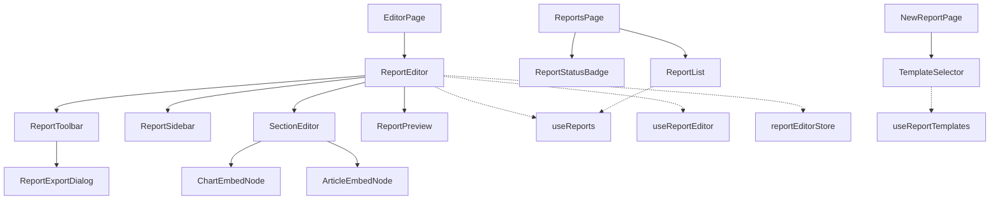

# 命题四：周报生成功能 -- 前端组件设计

> 文档编号: RPT-FE-005
> 版本: 1.0
> 更新日期: 2026-02-13
> 状态: 设计评审中
> 前置依赖: [02-architecture-design.md](./02-architecture-design.md)

---

## 目录

1. [新增依赖清单](#一新增依赖清单)
2. [页面路由设计](#二页面路由设计)
3. [TypeScript 类型定义](#三typescript-类型定义)
4. [组件设计](#四组件设计)
5. [Hooks 设计](#五hooks-设计)
6. [Zustand Store 设计](#六zustand-store-设计)
7. [Tiptap 自定义扩展](#七tiptap-自定义扩展)
8. [响应式设计](#八响应式设计)
9. [文件结构总览](#九文件结构总览)

---

## 一、新增依赖清单

### 1.1 Tiptap 富文本编辑器族

```bash
pnpm add @tiptap/react @tiptap/starter-kit @tiptap/extension-table \
  @tiptap/extension-image @tiptap/extension-link @tiptap/extension-placeholder \
  @tiptap/extension-typography @tiptap/extension-text-align
```

| 包名 | 用途 | 版本约束 |
|:-----|:-----|:---------|
| `@tiptap/react` | Tiptap React 绑定 | `^2.x` |
| `@tiptap/starter-kit` | 基础编辑能力 (粗体/斜体/列表/标题等) | `^2.x` |
| `@tiptap/extension-table` | 表格支持 (统计数据表格) | `^2.x` |
| `@tiptap/extension-image` | 图片嵌入 (图表截图/Logo) | `^2.x` |
| `@tiptap/extension-link` | 超链接 (资讯原文链接) | `^2.x` |
| `@tiptap/extension-placeholder` | 占位提示文本 | `^2.x` |
| `@tiptap/extension-typography` | 排版增强 (中文引号/省略号) | `^2.x` |
| `@tiptap/extension-text-align` | 文本对齐 (封面居中等) | `^2.x` |

### 1.2 已有依赖 (无需安装)

| 包名 | 用途 |
|:-----|:-----|
| `echarts` + `echarts-for-react` | 图表渲染 (嵌入报告的图表节点) |
| `recharts` | 轻量图表 (趋势线等) |
| `zustand` | 编辑器全局状态 |
| `@tanstack/react-query` | 服务端数据获取 |
| `lucide-react` | 图标库 |
| `dompurify` | HTML 内容清理 (预览/导出) |

---

## 二、页面路由设计

### 2.1 路由表

项目已有 `[locale]` 路由前缀的多语言模式。报告模块的路由嵌套在 `[locale]` 下：

```
apps/web/src/app/[locale]/
  reports/
    page.tsx              -> /reports        报告管理列表
    new/
      page.tsx            -> /reports/new    新建报告 (模板选择+基本信息)
    [id]/
      page.tsx            -> /reports/:id    报告编辑器
      preview/
        page.tsx          -> /reports/:id/preview   报告预览
      history/
        page.tsx          -> /reports/:id/history   版本历史
    templates/
      page.tsx            -> /reports/templates      模板管理列表
```

### 2.2 页面级组件结构

每个页面遵循项目已有的布局模式 (参考 `analytics/page.tsx`)：

```tsx
// /reports/page.tsx 示例结构
"use client";

import { ProtectedRoute } from "@/components/auth/protected-route";
import { Header } from "@/components/layout/header";
import { MainContent } from "@/components/layout/main-content";
import { Sidebar } from "@/components/layout/sidebar";
import { ReportList } from "@/components/reports/report-list";

export default function ReportsPage() {
  return (
    <ProtectedRoute>
      <div className="flex min-h-screen bg-neutral-50">
        <Sidebar />
        <MainContent>
          <Header />
          <div className="p-6">
            {/* 页面标题 + 操作按钮 */}
            {/* ReportList 组件 */}
          </div>
        </MainContent>
      </div>
    </ProtectedRoute>
  );
}
```

### 2.3 页面职责说明

| 路由 | 页面文件 | 核心功能 |
|:-----|:---------|:---------|
| `/reports` | `reports/page.tsx` | 报告列表(表格)、状态过滤、搜索、新建按钮 |
| `/reports/new` | `reports/new/page.tsx` | 模板选择网格 + 报告基本信息表单 + 创建触发 |
| `/reports/:id` | `reports/[id]/page.tsx` | 三栏编辑器布局：侧边章节导航 + Tiptap 编辑器 + 实时预览 |
| `/reports/:id/preview` | `reports/[id]/preview/page.tsx` | 全屏只读预览 + 导出操作 |
| `/reports/:id/history` | `reports/[id]/history/page.tsx` | 版本快照列表 + Diff 对比 |
| `/reports/templates` | `reports/templates/page.tsx` | 模板管理列表(系统模板只读 + 私有模板可编辑) |

---

## 三、TypeScript 类型定义

所有后端 DTO 的前端镜像类型。遵循项目 `types.ts` 的严格类型风格，不使用 `any`。

### 3.1 核心类型 (添加到 `lib/api/types.ts`)

```typescript
// ---------------------------------------------------------------------------
// Report Template
// ---------------------------------------------------------------------------

export type ReportType = "weekly" | "monthly" | "quarterly" | "custom";
export type TemplateAudience = "management" | "legal_team" | "external_client" | "internal";

export interface TemplateSectionDef {
  id: string;
  type: SectionType;
  title: string;
  order: number;
  auto_fill: boolean;
  data_source: string | null;
  content?: string;
}

export type SectionType =
  | "cover"
  | "toc"
  | "text"
  | "articles"
  | "charts"
  | "calendar"
  | "risk"
  | "static";

export interface TemplateStyleConfig {
  paper_size: string;
  margin: { top_mm: number; bottom_mm: number; left_mm: number; right_mm: number };
  font_family: string;
  title_font_size_pt: number;
  h1_font_size_pt?: number;
  h2_font_size_pt?: number;
  h3_font_size_pt?: number;
  body_font_size_pt: number;
  line_spacing: number;
  header: { show_logo: boolean; text: string; classification: string };
  footer: { text: string; show_page_number: boolean; show_date: boolean };
  cover?: { show_logo: boolean; show_period: boolean; show_org_name: boolean; bg_color: string };
}

export interface ReportTemplate {
  id: string;
  tenant_id: string | null;
  name: string;
  description: string | null;
  slug: string;
  report_type: ReportType;
  audience: TemplateAudience;
  sections: TemplateSectionDef[];
  style_config: TemplateStyleConfig;
  body_template: string | null;
  is_system: boolean;
  version: number;
  created_at: string;
  updated_at: string;
}

// ---------------------------------------------------------------------------
// Report
// ---------------------------------------------------------------------------

export type ReportStatus =
  | "draft"
  | "generating"
  | "review"
  | "approved"
  | "published"
  | "archived";

export interface ReportSectionContent {
  markdown?: string;
  html?: string;
  articles?: ReportArticleRef[];
  charts?: ReportChartRef[];
  [key: string]: unknown;
}

export interface ReportArticleRef {
  article_id: string;
  title: string;
  summary: string;
  risk_score: number | null;
  importance: number | null;
  link: string;
}

export interface ReportChartRef {
  chart_id: string;
  type: string;
  title: string;
  svg_object_key: string | null;
  data_snapshot: Record<string, unknown>;
}

export interface ReportContent {
  sections: Record<string, ReportSectionContent>;
  metadata: {
    generated_by: "system" | "user";
    ai_model: string | null;
    generation_timestamp: string | null;
    data_query_params: {
      date_from: string;
      date_to: string;
    } | null;
  };
}

export interface Report {
  id: string;
  tenant_id: string;
  title: string;
  report_number: string | null;
  period_type: ReportType;
  period_start: string;
  period_end: string;
  template_id: string | null;
  content: ReportContent;
  status: ReportStatus;
  author_id: string;
  reviewer_id: string | null;
  approved_at: string | null;
  published_at: string | null;
  pdf_object_key: string | null;
  docx_object_key: string | null;
  html_object_key: string | null;
  version: number;
  created_at: string;
  updated_at: string;
}

export interface ReportListResponse {
  data: Report[];
  total: number;
  limit: number;
  offset: number;
}

// ---------------------------------------------------------------------------
// Report Snapshot
// ---------------------------------------------------------------------------

export interface ReportSnapshot {
  id: string;
  report_id: string;
  snapshot_version: number;
  content: ReportContent;
  changed_by: string;
  change_summary: string | null;
  created_at: string;
}

// ---------------------------------------------------------------------------
// Report API Request DTOs
// ---------------------------------------------------------------------------

export interface CreateReportInput {
  title: string;
  period_type: ReportType;
  period_start: string;
  period_end: string;
  template_id: string | null;
}

export interface UpdateReportInput {
  title?: string;
  content?: ReportContent;
}

export interface ReportStatusChangeInput {
  action: "submit_review" | "approve" | "reject" | "publish" | "archive" | "recall";
  comment?: string;
}

export type ExportFormat = "pdf" | "docx" | "html";

export interface ExportReportInput {
  format: ExportFormat;
}

export interface ExportReportResponse {
  task_id: string;
  format: ExportFormat;
}

export interface GenerateReportInput {
  template_id: string;
  period_type: ReportType;
  period_start: string;
  period_end: string;
  title?: string;
}

// ---------------------------------------------------------------------------
// Report Template API Request DTOs
// ---------------------------------------------------------------------------

export interface CreateTemplateInput {
  name: string;
  slug: string;
  report_type: ReportType;
  audience: TemplateAudience;
  description?: string;
  sections: TemplateSectionDef[];
  style_config?: Partial<TemplateStyleConfig>;
}

export interface UpdateTemplateInput {
  name?: string;
  description?: string;
  sections?: TemplateSectionDef[];
  style_config?: Partial<TemplateStyleConfig>;
}
```

### 3.2 Runtime 校验函数

遵循项目已有的 `assert*` 函数模式 (参考 `types.ts` 中的 `assertArticle`)，为每个后端响应类型提供运行时校验：

```typescript
// assertReportTemplate, assertReport, assertReportSnapshot 等
// 遵循项目现有的 assertRecord + assertString + assertNumber 工具函数模式
// 在实施阶段逐一编写，此处仅列出签名

export function assertReportTemplate(
  value: unknown,
  path?: string,
): asserts value is ReportTemplate;

export function assertReport(
  value: unknown,
  path?: string,
): asserts value is Report;

export function assertReportListResponse(
  value: unknown,
  path?: string,
): asserts value is ReportListResponse;

export function assertReportSnapshot(
  value: unknown,
  path?: string,
): asserts value is ReportSnapshot;

export function assertReportSnapshotList(
  value: unknown,
  path?: string,
): asserts value is ReportSnapshot[];
```

---

## 四、组件设计

### 4.1 组件文件结构

```
apps/web/src/components/reports/
  report-list.tsx              # a) 报告列表
  report-editor.tsx            # b) 主编辑器容器
  report-toolbar.tsx           # c) 编辑器工具栏
  report-sidebar.tsx           # d) 章节导航侧边栏
  report-preview.tsx           # e) 报告预览
  report-export-dialog.tsx     # f) 导出对话框
  template-selector.tsx        # g) 模板选择器
  section-editor.tsx           # h) 章节编辑器
  chart-embed-node.tsx         # i) 图表嵌入 Tiptap 节点
  article-embed-node.tsx       # j) 资讯引用 Tiptap 节点
  report-status-badge.tsx      # k) 状态标签
```

---

### a) ReportList -- 报告列表

**职责**: 展示报告表格，支持状态过滤、关键词搜索、排序、分页。

```typescript
// ---------------------------------------------------------------------------
// Props
// ---------------------------------------------------------------------------

interface ReportListProps {
  /** 初始过滤状态 (可通过 URL query 参数传入) */
  initialStatus?: ReportStatus;
}

// ---------------------------------------------------------------------------
// 内部状态
// ---------------------------------------------------------------------------
// - searchQuery: string (搜索关键词，防抖 300ms)
// - statusFilter: ReportStatus | "all"
// - sortField: "updated_at" | "created_at" | "period_start"
// - sortOrder: "asc" | "desc"
// - page: number (当前分页)
// - limit: number (每页条数，默认 20)
```

**组件结构 (JSX 伪代码):**

```tsx
export function ReportList({ initialStatus }: ReportListProps) {
  const t = useT();
  const [statusFilter, setStatusFilter] = useState<ReportStatus | "all">(initialStatus ?? "all");
  const [searchQuery, setSearchQuery] = useState("");
  const [page, setPage] = useState(0);
  const debouncedSearch = useDebouncedValue(searchQuery, 300);

  const { data, isLoading, isError, error, refetch } = useReports({
    status: statusFilter === "all" ? undefined : statusFilter,
    search: debouncedSearch || undefined,
    offset: page * 20,
    limit: 20,
  });

  return (
    <div className="space-y-4">
      {/* 顶部操作栏: 搜索框 + 状态过滤下拉 + 新建按钮 */}
      <div className="flex items-center justify-between gap-4">
        <div className="flex items-center gap-3">
          <SearchInput value={searchQuery} onChange={setSearchQuery} />
          <StatusFilterSelect value={statusFilter} onChange={setStatusFilter} />
        </div>
        <Link href="/reports/new">
          <Button>{t("New Report")}</Button>
        </Link>
      </div>

      {/* 表格 */}
      {isLoading ? <TableSkeleton rows={5} /> : null}
      {isError ? <EmptyState variant="error" ... /> : null}
      {data ? (
        <table className="w-full text-sm">
          <thead>
            <tr className="border-b border-neutral-200 text-left text-neutral-500">
              <th className="pb-3 font-medium">{t("Title")}</th>
              <th className="pb-3 font-medium">{t("Report Number")}</th>
              <th className="pb-3 font-medium">{t("Period")}</th>
              <th className="pb-3 font-medium">{t("Status")}</th>
              <th className="pb-3 font-medium">{t("Updated")}</th>
              <th className="pb-3 font-medium">{t("Actions")}</th>
            </tr>
          </thead>
          <tbody>
            {data.data.map((report) => (
              <ReportListRow key={report.id} report={report} />
            ))}
          </tbody>
        </table>
      ) : null}

      {/* 分页 */}
      {data ? <Pagination total={data.total} page={page} onPageChange={setPage} /> : null}
    </div>
  );
}
```

**与 API 的交互**: 通过 `useReports` hook (见 5.1 节) 调用 `GET /api/v1/reports`。

---

### b) ReportEditor -- 主编辑器容器

**职责**: 报告编辑的顶层容器组件，管理三栏布局、章节切换、自动保存。

```typescript
// ---------------------------------------------------------------------------
// Props
// ---------------------------------------------------------------------------

interface ReportEditorProps {
  reportId: string;
}
```

**组件结构 (JSX 伪代码):**

```tsx
export function ReportEditor({ reportId }: ReportEditorProps) {
  const t = useT();
  const { data: report, isLoading, isError } = useReport(reportId);
  const { mutate: updateReport } = useUpdateReport(reportId);
  const { activeSectionId, setActiveSectionId, hasUnsavedChanges } = useReportEditorStore();

  // 自动保存: 防抖 2 秒
  const debouncedSave = useDebouncedCallback(
    (content: ReportContent) => {
      updateReport({ content });
    },
    2000,
  );

  if (isLoading) return <EditorSkeleton />;
  if (isError || !report) return <EmptyState variant="error" ... />;

  const template = report.template_id ? /* fetch template */ null : null;
  const sectionDefs: TemplateSectionDef[] = template?.sections ?? [];

  return (
    <div className="flex h-[calc(100vh-64px)]">
      {/* 左侧: 章节导航 */}
      <ReportSidebar
        sections={sectionDefs}
        activeSectionId={activeSectionId}
        onSectionSelect={setActiveSectionId}
        reportStatus={report.status}
      />

      {/* 中间: 编辑器 */}
      <div className="flex flex-1 flex-col overflow-hidden">
        {/* 工具栏 */}
        <ReportToolbar
          reportId={reportId}
          status={report.status}
          hasUnsavedChanges={hasUnsavedChanges}
          onSave={() => updateReport({ content: report.content })}
        />

        {/* 章节编辑器 */}
        <div className="flex-1 overflow-y-auto p-6">
          <SectionEditor
            sectionId={activeSectionId}
            sectionDef={sectionDefs.find((s) => s.id === activeSectionId) ?? null}
            content={report.content.sections[activeSectionId] ?? {}}
            onChange={(updated) => {
              const newContent = {
                ...report.content,
                sections: { ...report.content.sections, [activeSectionId]: updated },
              };
              debouncedSave(newContent);
            }}
            readOnly={report.status !== "draft"}
          />
        </div>
      </div>

      {/* 右侧: 实时预览 (桌面端可见) */}
      <div className="hidden w-[400px] border-l border-neutral-200 xl:block">
        <ReportPreview
          content={report.content}
          activeSectionId={activeSectionId}
          compact
        />
      </div>
    </div>
  );
}
```

**状态管理方案**:
- 报告数据: `@tanstack/react-query` 管理 (server state)
- 编辑器 UI 状态 (当前章节、未保存标志): `reportEditorStore` (zustand)
- 自动保存: 防抖 `useMutation` + optimistic update

**与 API 的交互**:
- `useReport(id)` -- `GET /api/v1/reports/:id`
- `useUpdateReport(id)` -- `PUT /api/v1/reports/:id` (带 `If-Match` 乐观并发)

---

### c) ReportToolbar -- 编辑器工具栏

**职责**: 提供编辑器顶部操作栏 -- 格式化按钮、插入操作、保存/发布状态流转。

```typescript
// ---------------------------------------------------------------------------
// Props
// ---------------------------------------------------------------------------

interface ReportToolbarProps {
  reportId: string;
  status: ReportStatus;
  hasUnsavedChanges: boolean;
  onSave: () => void;
}
```

**组件结构 (JSX 伪代码):**

```tsx
export function ReportToolbar({
  reportId,
  status,
  hasUnsavedChanges,
  onSave,
}: ReportToolbarProps) {
  const t = useT();
  const { mutate: changeStatus } = useReportStatusChange(reportId);
  const [showExportDialog, setShowExportDialog] = useState(false);

  const isEditable = status === "draft";

  return (
    <div className="flex items-center justify-between border-b border-neutral-200 bg-white px-4 py-2">
      {/* 左侧: 格式化工具 (仅编辑模式可见) */}
      {isEditable ? (
        <div className="flex items-center gap-1">
          {/* Tiptap 命令按钮: Bold, Italic, Heading, List, Link, Image */}
          <ToolbarButton icon={Bold} tooltip={t("Bold")} command="toggleBold" />
          <ToolbarButton icon={Italic} tooltip={t("Italic")} command="toggleItalic" />
          <ToolbarSeparator />
          <ToolbarButton icon={Heading1} tooltip={t("Heading 1")} command="toggleHeading" level={1} />
          <ToolbarButton icon={Heading2} tooltip={t("Heading 2")} command="toggleHeading" level={2} />
          <ToolbarSeparator />
          <ToolbarButton icon={List} tooltip={t("Bullet List")} command="toggleBulletList" />
          <ToolbarButton icon={ListOrdered} tooltip={t("Ordered List")} command="toggleOrderedList" />
          <ToolbarSeparator />
          {/* 插入操作 */}
          <ToolbarButton icon={BarChart3} tooltip={t("Insert Chart")} command="insertChartBlock" />
          <ToolbarButton icon={FileText} tooltip={t("Insert Article Reference")} command="insertArticleRef" />
          <ToolbarButton icon={TableIcon} tooltip={t("Insert Table")} command="insertTable" />
        </div>
      ) : (
        <div className="text-sm text-neutral-500">
          {t("Read-only mode")} -- {t(`Status: ${status}`)}
        </div>
      )}

      {/* 右侧: 操作按钮 */}
      <div className="flex items-center gap-2">
        {/* 保存状态指示 */}
        {hasUnsavedChanges ? (
          <span className="text-xs text-amber-600">{t("Unsaved changes")}</span>
        ) : (
          <span className="text-xs text-green-600">{t("Saved")}</span>
        )}

        {isEditable ? (
          <Button variant="outline" size="sm" onClick={onSave} disabled={!hasUnsavedChanges}>
            {t("Save")}
          </Button>
        ) : null}

        {/* 状态流转按钮 */}
        {status === "draft" ? (
          <Button size="sm" onClick={() => changeStatus({ action: "submit_review" })}>
            {t("Submit for Review")}
          </Button>
        ) : null}
        {status === "review" ? (
          <>
            <Button variant="outline" size="sm" onClick={() => changeStatus({ action: "reject" })}>
              {t("Reject")}
            </Button>
            <Button size="sm" onClick={() => changeStatus({ action: "approve" })}>
              {t("Approve")}
            </Button>
          </>
        ) : null}
        {status === "approved" ? (
          <Button size="sm" onClick={() => changeStatus({ action: "publish" })}>
            {t("Publish")}
          </Button>
        ) : null}

        {/* 导出 */}
        <Button variant="outline" size="sm" onClick={() => setShowExportDialog(true)}>
          {t("Export")}
        </Button>

        {showExportDialog ? (
          <ReportExportDialog
            reportId={reportId}
            onClose={() => setShowExportDialog(false)}
          />
        ) : null}
      </div>
    </div>
  );
}
```

**与 API 的交互**: `useReportStatusChange(id)` -- `POST /api/v1/reports/:id/status`

---

### d) ReportSidebar -- 章节导航侧边栏

**职责**: 显示报告的章节结构树，支持拖拽排序 (未来)、当前章节高亮。

```typescript
// ---------------------------------------------------------------------------
// Props
// ---------------------------------------------------------------------------

interface ReportSidebarProps {
  sections: TemplateSectionDef[];
  activeSectionId: string;
  onSectionSelect: (sectionId: string) => void;
  reportStatus: ReportStatus;
}
```

**组件结构 (JSX 伪代码):**

```tsx
/** 章节类型 -> 图标映射 */
const SECTION_ICON_MAP: Record<SectionType, LucideIcon> = {
  cover: BookOpen,
  toc: List,
  text: FileText,
  articles: Newspaper,
  charts: BarChart3,
  calendar: Calendar,
  risk: AlertTriangle,
  static: FileText,
};

export function ReportSidebar({
  sections,
  activeSectionId,
  onSectionSelect,
  reportStatus,
}: ReportSidebarProps) {
  const t = useT();
  const sortedSections = [...sections].sort((a, b) => a.order - b.order);

  return (
    <aside className="w-60 shrink-0 overflow-y-auto border-r border-neutral-200 bg-neutral-50">
      {/* 报告状态 */}
      <div className="border-b border-neutral-200 px-4 py-3">
        <ReportStatusBadge status={reportStatus} />
      </div>

      {/* 章节列表 */}
      <nav className="p-2">
        <p className="mb-2 px-2 text-xs font-medium uppercase tracking-wider text-neutral-400">
          {t("Sections")}
        </p>
        <ul className="space-y-0.5">
          {sortedSections.map((section) => {
            const Icon = SECTION_ICON_MAP[section.type] ?? FileText;
            const isActive = activeSectionId === section.id;

            return (
              <li key={section.id}>
                <button
                  type="button"
                  onClick={() => onSectionSelect(section.id)}
                  className={cn(
                    "flex w-full items-center gap-2 rounded-lg px-3 py-2 text-sm transition-colors",
                    isActive
                      ? "bg-primary-100 text-primary-700 font-medium"
                      : "text-neutral-600 hover:bg-neutral-100 hover:text-neutral-900",
                  )}
                >
                  <Icon className="h-4 w-4 shrink-0" aria-hidden="true" />
                  <span className="truncate">{section.title}</span>
                  {section.auto_fill ? (
                    <span className="ml-auto text-[10px] text-primary-400">{t("Auto")}</span>
                  ) : null}
                </button>
              </li>
            );
          })}
        </ul>
      </nav>
    </aside>
  );
}
```

**状态管理方案**: 纯受控组件，所有状态由父组件 (`ReportEditor`) 通过 props 传入。

---

### e) ReportPreview -- 报告预览

**职责**: 将结构化报告内容渲染为可视化 HTML 预览，支持打印友好样式。

```typescript
// ---------------------------------------------------------------------------
// Props
// ---------------------------------------------------------------------------

interface ReportPreviewProps {
  content: ReportContent;
  /** 当前聚焦的章节 (编辑器模式下用于滚动定位) */
  activeSectionId?: string;
  /** 紧凑模式 (用于编辑器右侧面板) */
  compact?: boolean;
}
```

**组件结构 (JSX 伪代码):**

```tsx
export function ReportPreview({ content, activeSectionId, compact }: ReportPreviewProps) {
  const previewRef = useRef<HTMLDivElement>(null);

  // 当 activeSectionId 变化时，滚动到对应章节
  useEffect(() => {
    if (activeSectionId && previewRef.current) {
      const sectionEl = previewRef.current.querySelector(`[data-section-id="${activeSectionId}"]`);
      sectionEl?.scrollIntoView({ behavior: "smooth", block: "start" });
    }
  }, [activeSectionId]);

  const sectionEntries = Object.entries(content.sections);

  return (
    <div
      ref={previewRef}
      className={cn(
        "overflow-y-auto bg-white",
        compact ? "p-4 text-sm" : "mx-auto max-w-4xl p-8 shadow-lg",
      )}
    >
      {sectionEntries.map(([sectionId, sectionContent]) => (
        <div
          key={sectionId}
          data-section-id={sectionId}
          className="mb-8"
        >
          {/* 渲染 HTML 内容 (经过 DOMPurify 清理) */}
          {sectionContent.html ? (
            <div
              className="prose prose-neutral max-w-none"
              dangerouslySetInnerHTML={{
                __html: DOMPurify.sanitize(sectionContent.html),
              }}
            />
          ) : sectionContent.markdown ? (
            <div className="prose prose-neutral max-w-none">
              {/* 使用 Markdown 渲染 */}
              <MarkdownRenderer content={sectionContent.markdown} />
            </div>
          ) : null}

          {/* 渲染嵌入的图表 */}
          {sectionContent.charts?.map((chart) => (
            <div key={chart.chart_id} className="my-4">
              <PreviewChart chart={chart} compact={compact} />
            </div>
          ))}

          {/* 渲染资讯引用列表 */}
          {sectionContent.articles?.map((article) => (
            <PreviewArticleCard key={article.article_id} article={article} compact={compact} />
          ))}
        </div>
      ))}
    </div>
  );
}
```

**与 API 的交互**: 纯展示组件，不直接调用 API。数据通过 props 传入。

---

### f) ReportExportDialog -- 导出对话框

**职责**: 选择导出格式 (PDF/Word/HTML)、触发导出任务、显示导出进度、下载完成文件。

```typescript
// ---------------------------------------------------------------------------
// Props
// ---------------------------------------------------------------------------

interface ReportExportDialogProps {
  reportId: string;
  onClose: () => void;
}
```

**组件结构 (JSX 伪代码):**

```tsx
type ExportStep = "select" | "exporting" | "done" | "error";

export function ReportExportDialog({ reportId, onClose }: ReportExportDialogProps) {
  const t = useT();
  const [format, setFormat] = useState<ExportFormat>("pdf");
  const [step, setStep] = useState<ExportStep>("select");
  const { mutate: triggerExport, data: exportResult } = useExportReport(reportId);

  const FORMAT_OPTIONS: Array<{
    value: ExportFormat;
    label: string;
    icon: LucideIcon;
    description: string;
  }> = [
    { value: "pdf", label: "PDF", icon: FileText, description: t("Print-ready document") },
    { value: "docx", label: "Word", icon: FileType, description: t("Editable document") },
    { value: "html", label: "HTML", icon: Globe2, description: t("Web format") },
  ];

  const handleExport = () => {
    setStep("exporting");
    triggerExport(
      { format },
      {
        onSuccess: () => setStep("done"),
        onError: () => setStep("error"),
      },
    );
  };

  return (
    <Dialog open onOpenChange={onClose}>
      <DialogContent className="sm:max-w-md">
        <DialogHeader>
          <DialogTitle>{t("Export Report")}</DialogTitle>
        </DialogHeader>

        {step === "select" ? (
          <div className="space-y-4">
            {/* 格式选择卡片 */}
            <div className="grid grid-cols-3 gap-3">
              {FORMAT_OPTIONS.map((opt) => (
                <button
                  key={opt.value}
                  type="button"
                  onClick={() => setFormat(opt.value)}
                  className={cn(
                    "flex flex-col items-center gap-2 rounded-lg border p-4 transition-colors",
                    format === opt.value
                      ? "border-primary-500 bg-primary-50"
                      : "border-neutral-200 hover:bg-neutral-50",
                  )}
                >
                  <opt.icon className="h-8 w-8" />
                  <span className="text-sm font-medium">{opt.label}</span>
                  <span className="text-xs text-neutral-500">{opt.description}</span>
                </button>
              ))}
            </div>

            <Button className="w-full" onClick={handleExport}>
              {t("Start Export")}
            </Button>
          </div>
        ) : null}

        {step === "exporting" ? (
          <div className="flex flex-col items-center gap-4 py-8">
            <div className="h-10 w-10 animate-spin rounded-full border-2 border-primary-500 border-t-transparent" />
            <p className="text-sm text-neutral-600">{t("Generating document...")}</p>
          </div>
        ) : null}

        {step === "done" ? (
          <div className="flex flex-col items-center gap-4 py-8">
            <CheckCircle className="h-12 w-12 text-green-500" />
            <p className="text-sm font-medium">{t("Export complete!")}</p>
            <Button asChild>
              <a href={`/api/v1/reports/${reportId}/download/${format}`}>
                {t("Download")}
              </a>
            </Button>
          </div>
        ) : null}

        {step === "error" ? (
          <div className="flex flex-col items-center gap-4 py-8">
            <AlertTriangle className="h-12 w-12 text-red-500" />
            <p className="text-sm text-red-600">{t("Export failed")}</p>
            <Button variant="outline" onClick={() => setStep("select")}>
              {t("Retry")}
            </Button>
          </div>
        ) : null}
      </DialogContent>
    </Dialog>
  );
}
```

**与 API 的交互**:
- `useExportReport(id)` -- `POST /api/v1/reports/:id/export`
- 下载: `GET /api/v1/reports/:id/download/:format` (浏览器直接跳转)

---

### g) TemplateSelector -- 模板选择器

**职责**: 以卡片网格形式展示可用模板，用户选择后进入报告创建流程。

```typescript
// ---------------------------------------------------------------------------
// Props
// ---------------------------------------------------------------------------

interface TemplateSelectorProps {
  onSelect: (template: ReportTemplate) => void;
}
```

**组件结构 (JSX 伪代码):**

```tsx
const REPORT_TYPE_ICON: Record<ReportType, LucideIcon> = {
  weekly: Calendar,
  monthly: CalendarDays,
  quarterly: CalendarRange,
  custom: Settings,
};

const AUDIENCE_LABEL: Record<TemplateAudience, string> = {
  management: "Management",
  legal_team: "Legal Team",
  external_client: "External Client",
  internal: "Internal",
};

export function TemplateSelector({ onSelect }: TemplateSelectorProps) {
  const t = useT();
  const { data: templates, isLoading } = useReportTemplates();
  const [typeFilter, setTypeFilter] = useState<ReportType | "all">("all");

  const filtered = templates?.filter(
    (tpl) => typeFilter === "all" || tpl.report_type === typeFilter,
  );

  return (
    <div className="space-y-6">
      {/* 类型过滤 Tab */}
      <div className="flex gap-2">
        {(["all", "weekly", "monthly", "quarterly", "custom"] as const).map((type) => (
          <button
            key={type}
            type="button"
            onClick={() => setTypeFilter(type)}
            className={cn(
              "rounded-lg px-4 py-2 text-sm font-medium transition-colors",
              typeFilter === type
                ? "bg-primary-100 text-primary-700"
                : "text-neutral-600 hover:bg-neutral-100",
            )}
          >
            {type === "all" ? t("All") : t(type)}
          </button>
        ))}
      </div>

      {/* 模板卡片网格 */}
      {isLoading ? (
        <div className="grid grid-cols-1 gap-4 sm:grid-cols-2 lg:grid-cols-3">
          {Array.from({ length: 6 }, (_, i) => `tpl-skel-${i}`).map((key) => (
            <div key={key} className="h-48 animate-pulse rounded-lg bg-neutral-100" />
          ))}
        </div>
      ) : (
        <div className="grid grid-cols-1 gap-4 sm:grid-cols-2 lg:grid-cols-3">
          {filtered?.map((template) => {
            const TypeIcon = REPORT_TYPE_ICON[template.report_type];
            return (
              <button
                key={template.id}
                type="button"
                onClick={() => onSelect(template)}
                className="group flex flex-col rounded-lg border border-neutral-200 p-5 text-left transition-all hover:border-primary-300 hover:shadow-md"
              >
                <div className="flex items-center gap-3">
                  <div className="flex h-10 w-10 items-center justify-center rounded-lg bg-primary-50">
                    <TypeIcon className="h-5 w-5 text-primary-600" />
                  </div>
                  <div>
                    <h3 className="text-sm font-semibold text-neutral-900">{template.name}</h3>
                    <span className="text-xs text-neutral-500">
                      {t(AUDIENCE_LABEL[template.audience])}
                    </span>
                  </div>
                </div>
                {template.description ? (
                  <p className="mt-3 line-clamp-2 text-xs text-neutral-600">
                    {template.description}
                  </p>
                ) : null}
                <div className="mt-auto flex items-center gap-2 pt-4">
                  <span className="text-xs text-neutral-400">
                    {template.sections.length} {t("sections")}
                  </span>
                  {template.is_system ? (
                    <Badge variant="outline" className="ml-auto text-[10px]">
                      {t("System")}
                    </Badge>
                  ) : null}
                </div>
              </button>
            );
          })}
        </div>
      )}
    </div>
  );
}
```

**与 API 的交互**: `useReportTemplates()` -- `GET /api/v1/report-templates`

---

### h) SectionEditor -- 章节编辑器

**职责**: 每个报告章节对应一个独立的 Tiptap 编辑器实例，根据章节类型渲染不同的编辑模式。

```typescript
// ---------------------------------------------------------------------------
// Props
// ---------------------------------------------------------------------------

interface SectionEditorProps {
  sectionId: string;
  sectionDef: TemplateSectionDef | null;
  content: ReportSectionContent;
  onChange: (updated: ReportSectionContent) => void;
  readOnly: boolean;
}
```

**组件结构 (JSX 伪代码):**

```tsx
export function SectionEditor({
  sectionId,
  sectionDef,
  content,
  onChange,
  readOnly,
}: SectionEditorProps) {
  const t = useT();

  // 根据章节类型决定渲染模式
  const sectionType = sectionDef?.type ?? "text";

  switch (sectionType) {
    case "cover":
      return (
        <CoverSectionEditor
          content={content}
          onChange={onChange}
          readOnly={readOnly}
        />
      );

    case "toc":
      return (
        <div className="rounded-lg border border-neutral-200 bg-neutral-50 p-6">
          <p className="text-sm text-neutral-500">{t("Table of contents will be auto-generated")}</p>
        </div>
      );

    case "text":
    case "static":
      return (
        <TiptapSectionEditor
          key={sectionId}
          initialContent={content.html ?? content.markdown ?? ""}
          onChange={(html, markdown) => onChange({ ...content, html, markdown })}
          readOnly={readOnly || sectionType === "static"}
          placeholder={t("Start writing...")}
        />
      );

    case "articles":
      return (
        <ArticlesSectionEditor
          sectionId={sectionId}
          content={content}
          onChange={onChange}
          readOnly={readOnly}
          dataSource={sectionDef?.data_source ?? null}
        />
      );

    case "charts":
      return (
        <ChartsSectionEditor
          sectionId={sectionId}
          content={content}
          onChange={onChange}
          readOnly={readOnly}
        />
      );

    case "risk":
      return (
        <RiskSectionEditor
          content={content}
          onChange={onChange}
          readOnly={readOnly}
        />
      );

    case "calendar":
      return (
        <CalendarSectionEditor
          content={content}
          onChange={onChange}
          readOnly={readOnly}
        />
      );

    default:
      return (
        <TiptapSectionEditor
          key={sectionId}
          initialContent={content.html ?? ""}
          onChange={(html, markdown) => onChange({ ...content, html, markdown })}
          readOnly={readOnly}
          placeholder={t("Start writing...")}
        />
      );
  }
}

// ---------------------------------------------------------------------------
// TiptapSectionEditor -- 核心 Tiptap 实例封装
// ---------------------------------------------------------------------------

interface TiptapSectionEditorProps {
  initialContent: string;
  onChange: (html: string, markdown: string) => void;
  readOnly: boolean;
  placeholder: string;
}

function TiptapSectionEditor({
  initialContent,
  onChange,
  readOnly,
  placeholder,
}: TiptapSectionEditorProps) {
  const editor = useEditor({
    extensions: [
      StarterKit,
      TextAlign.configure({ types: ["heading", "paragraph"] }),
      Link.configure({ openOnClick: false }),
      Image,
      Table.configure({ resizable: true }),
      Typography,
      Placeholder.configure({ placeholder }),
      // 自定义扩展
      ChartBlock,
      ArticleReference,
    ],
    content: initialContent,
    editable: !readOnly,
    onUpdate: ({ editor }) => {
      onChange(editor.getHTML(), editor.getText());
    },
  });

  return (
    <div className="rounded-lg border border-neutral-200 bg-white">
      <EditorContent
        editor={editor}
        className="prose prose-neutral max-w-none p-4 focus-within:ring-2 focus-within:ring-primary-200"
      />
    </div>
  );
}
```

**状态管理方案**: 每个 `TiptapSectionEditor` 维护自己的 Tiptap `editor` 实例，通过 `onChange` 回调将变更冒泡到父组件。

---

### i) ChartEmbedNode -- 图表嵌入节点

**职责**: Tiptap 自定义 Node Extension，在编辑器中渲染一个 echarts 图表块。

```typescript
// ---------------------------------------------------------------------------
// Tiptap Node 属性
// ---------------------------------------------------------------------------

interface ChartEmbedNodeAttrs {
  chartId: string;
  chartType: string;       // "pie" | "bar" | "line" | "heatmap" | "radar"
  title: string;
  dataSnapshot: string;    // JSON 序列化的数据快照
}
```

**组件结构 (React NodeView):**

```tsx
import { Node, mergeAttributes } from "@tiptap/core";
import { ReactNodeViewRenderer, NodeViewWrapper } from "@tiptap/react";
import ReactEChartsCore from "echarts-for-react/lib/core";
import * as echarts from "echarts/core";

function ChartEmbedNodeView({ node, updateAttributes }: NodeViewProps) {
  const { chartId, chartType, title, dataSnapshot } = node.attrs as ChartEmbedNodeAttrs;

  const parsedData = useMemo(() => {
    try {
      return JSON.parse(dataSnapshot) as Record<string, unknown>;
    } catch {
      return null;
    }
  }, [dataSnapshot]);

  // 根据 chartType 构建 echarts option
  const option = useMemo(() => buildChartOption(chartType, parsedData), [chartType, parsedData]);

  return (
    <NodeViewWrapper className="my-4 rounded-lg border border-neutral-200 bg-white p-4">
      <div className="mb-2 flex items-center justify-between">
        <h4 className="text-sm font-medium text-neutral-700">{title}</h4>
        <Badge variant="outline" className="text-[10px]">{chartType}</Badge>
      </div>
      {option ? (
        <ReactEChartsCore
          echarts={echarts}
          option={option}
          style={{ height: 300, width: "100%" }}
          notMerge
          lazyUpdate
        />
      ) : (
        <div className="flex h-[200px] items-center justify-center text-sm text-neutral-400">
          Invalid chart data
        </div>
      )}
    </NodeViewWrapper>
  );
}

// Tiptap Node Extension 定义
export const ChartBlock = Node.create({
  name: "chartBlock",
  group: "block",
  atom: true,
  draggable: true,

  addAttributes() {
    return {
      chartId: { default: "" },
      chartType: { default: "bar" },
      title: { default: "" },
      dataSnapshot: { default: "{}" },
    };
  },

  parseHTML() {
    return [{ tag: 'div[data-type="chart-block"]' }];
  },

  renderHTML({ HTMLAttributes }) {
    return ["div", mergeAttributes(HTMLAttributes, { "data-type": "chart-block" }), 0];
  },

  addNodeView() {
    return ReactNodeViewRenderer(ChartEmbedNodeView);
  },
});
```

---

### j) ArticleEmbedNode -- 资讯引用节点

**职责**: Tiptap 自定义 Node Extension，在编辑器中渲染一个资讯引用卡片。

```typescript
// ---------------------------------------------------------------------------
// Tiptap Node 属性
// ---------------------------------------------------------------------------

interface ArticleEmbedNodeAttrs {
  articleId: string;
  title: string;
  summary: string;
  link: string;
  riskScore: number | null;
  importance: number | null;
}
```

**组件结构 (React NodeView):**

```tsx
function ArticleEmbedNodeView({ node }: NodeViewProps) {
  const t = useT();
  const { articleId, title, summary, link, riskScore, importance } =
    node.attrs as ArticleEmbedNodeAttrs;

  return (
    <NodeViewWrapper className="my-3">
      <div className="flex gap-3 rounded-lg border border-neutral-200 bg-neutral-50 p-4 transition-colors hover:bg-neutral-100">
        <div className="flex h-10 w-10 shrink-0 items-center justify-center rounded-lg bg-primary-100">
          <FileText className="h-5 w-5 text-primary-600" aria-hidden="true" />
        </div>
        <div className="min-w-0 flex-1">
          <a
            href={link}
            target="_blank"
            rel="noopener noreferrer"
            className="text-sm font-medium text-neutral-900 hover:text-primary-600"
          >
            {title}
          </a>
          <p className="mt-1 line-clamp-2 text-xs text-neutral-600">{summary}</p>
          <div className="mt-2 flex items-center gap-3">
            {importance !== null ? (
              <span className="text-[10px] text-amber-600">
                {t("Importance")}: {importance}/5
              </span>
            ) : null}
            {riskScore !== null ? (
              <span className="text-[10px] text-red-600">
                {t("Risk")}: {riskScore}
              </span>
            ) : null}
          </div>
        </div>
      </div>
    </NodeViewWrapper>
  );
}

// Tiptap Node Extension 定义
export const ArticleReference = Node.create({
  name: "articleReference",
  group: "block",
  atom: true,
  draggable: true,

  addAttributes() {
    return {
      articleId: { default: "" },
      title: { default: "" },
      summary: { default: "" },
      link: { default: "" },
      riskScore: { default: null },
      importance: { default: null },
    };
  },

  parseHTML() {
    return [{ tag: 'div[data-type="article-reference"]' }];
  },

  renderHTML({ HTMLAttributes }) {
    return ["div", mergeAttributes(HTMLAttributes, { "data-type": "article-reference" }), 0];
  },

  addNodeView() {
    return ReactNodeViewRenderer(ArticleEmbedNodeView);
  },
});
```

---

### k) ReportStatusBadge -- 状态标签组件

**职责**: 将报告状态渲染为语义化的 Badge 组件。

```typescript
// ---------------------------------------------------------------------------
// Props
// ---------------------------------------------------------------------------

interface ReportStatusBadgeProps {
  status: ReportStatus;
  className?: string;
}
```

**组件结构:**

```tsx
const STATUS_CONFIG: Record<
  ReportStatus,
  { labelKey: string; variant: "outline" | "warning" | "success" | "destructive" | "secondary" }
> = {
  draft: { labelKey: "Draft", variant: "outline" },
  generating: { labelKey: "Generating", variant: "warning" },
  review: { labelKey: "In Review", variant: "secondary" },
  approved: { labelKey: "Approved", variant: "success" },
  published: { labelKey: "Published", variant: "success" },
  archived: { labelKey: "Archived", variant: "outline" },
};

export function ReportStatusBadge({ status, className }: ReportStatusBadgeProps) {
  const t = useT();
  const config = STATUS_CONFIG[status];

  return (
    <Badge variant={config.variant} className={className}>
      {t(config.labelKey)}
    </Badge>
  );
}
```

---

## 五、Hooks 设计

### 5.1 use-reports.ts -- 报告 CRUD Hooks

遵循项目已有的 hook 模式 (参考 `use-articles.ts` 和 `use-statistics.ts`)：

```typescript
"use client";

import { apiClient, ifMatchFromVersion } from "@/lib/api";
import {
  assertReport,
  assertReportListResponse,
  assertReportSnapshotList,
  type CreateReportInput,
  type ExportFormat,
  type ExportReportResponse,
  type Report,
  type ReportListResponse,
  type ReportSnapshot,
  type ReportStatusChangeInput,
  type UpdateReportInput,
} from "@/lib/api/types";
import { useMutation, useQuery, useQueryClient } from "@tanstack/react-query";

// ---------------------------------------------------------------------------
// Query Keys (集中管理，避免拼写错误)
// ---------------------------------------------------------------------------

const REPORT_KEYS = {
  all: ["reports"] as const,
  list: (filters: ReportListFilters) => ["reports", "list", filters] as const,
  detail: (id: string) => ["reports", "detail", id] as const,
  snapshots: (id: string) => ["reports", "snapshots", id] as const,
};

// ---------------------------------------------------------------------------
// 报告列表
// ---------------------------------------------------------------------------

interface ReportListFilters {
  status?: string;
  search?: string;
  period_type?: string;
  limit?: number;
  offset?: number;
}

export function useReports(filters: ReportListFilters = {}) {
  const { limit = 20, offset = 0, status, search, period_type } = filters;

  const params = new URLSearchParams();
  params.set("limit", limit.toString());
  params.set("offset", offset.toString());
  if (status) params.set("status", status);
  if (search) params.set("search", search);
  if (period_type) params.set("period_type", period_type);

  return useQuery({
    queryKey: REPORT_KEYS.list(filters),
    queryFn: () =>
      apiClient.get<ReportListResponse>(
        `/api/v1/reports?${params.toString()}`,
        assertReportListResponse,
      ),
    staleTime: 30_000,
  });
}

// ---------------------------------------------------------------------------
// 报告详情
// ---------------------------------------------------------------------------

export function useReport(id: string) {
  return useQuery({
    queryKey: REPORT_KEYS.detail(id),
    queryFn: () =>
      apiClient.get<Report>(`/api/v1/reports/${id}`, assertReport),
    enabled: !!id,
  });
}

// ---------------------------------------------------------------------------
// 创建报告
// ---------------------------------------------------------------------------

export function useCreateReport() {
  const queryClient = useQueryClient();

  return useMutation({
    mutationFn: (input: CreateReportInput) =>
      apiClient.post<Report>("/api/v1/reports", input, assertReport),
    onSuccess: () => {
      queryClient.invalidateQueries({ queryKey: REPORT_KEYS.all });
    },
  });
}

// ---------------------------------------------------------------------------
// 更新报告
// ---------------------------------------------------------------------------

export function useUpdateReport(reportId: string) {
  const queryClient = useQueryClient();

  return useMutation({
    mutationFn: ({ input, version }: { input: UpdateReportInput; version: number }) =>
      apiClient.patch<Report>(`/api/v1/reports/${reportId}`, input, assertReport, {
        headers: { "If-Match": ifMatchFromVersion(version) },
      }),
    onSuccess: (updatedReport) => {
      queryClient.setQueryData(REPORT_KEYS.detail(reportId), updatedReport);
      queryClient.invalidateQueries({ queryKey: REPORT_KEYS.all });
    },
  });
}

// ---------------------------------------------------------------------------
// 删除报告
// ---------------------------------------------------------------------------

export function useDeleteReport() {
  const queryClient = useQueryClient();

  return useMutation({
    mutationFn: (reportId: string) =>
      apiClient.delete(`/api/v1/reports/${reportId}`),
    onSuccess: () => {
      queryClient.invalidateQueries({ queryKey: REPORT_KEYS.all });
    },
  });
}

// ---------------------------------------------------------------------------
// 状态变更
// ---------------------------------------------------------------------------

export function useReportStatusChange(reportId: string) {
  const queryClient = useQueryClient();

  return useMutation({
    mutationFn: (input: ReportStatusChangeInput) =>
      apiClient.post<Report>(`/api/v1/reports/${reportId}/status`, input, assertReport),
    onSuccess: (updatedReport) => {
      queryClient.setQueryData(REPORT_KEYS.detail(reportId), updatedReport);
      queryClient.invalidateQueries({ queryKey: REPORT_KEYS.all });
    },
  });
}

// ---------------------------------------------------------------------------
// 导出报告
// ---------------------------------------------------------------------------

export function useExportReport(reportId: string) {
  return useMutation({
    mutationFn: (input: { format: ExportFormat }) =>
      apiClient.post<ExportReportResponse>(
        `/api/v1/reports/${reportId}/export`,
        input,
      ),
  });
}

// ---------------------------------------------------------------------------
// 自动生成报告
// ---------------------------------------------------------------------------

export function useGenerateReport() {
  const queryClient = useQueryClient();

  return useMutation({
    mutationFn: (input: {
      template_id: string;
      period_type: string;
      period_start: string;
      period_end: string;
      title?: string;
    }) => apiClient.post<Report>("/api/v1/reports/generate", input, assertReport),
    onSuccess: () => {
      queryClient.invalidateQueries({ queryKey: REPORT_KEYS.all });
    },
  });
}

// ---------------------------------------------------------------------------
// 版本历史
// ---------------------------------------------------------------------------

export function useReportSnapshots(reportId: string) {
  return useQuery({
    queryKey: REPORT_KEYS.snapshots(reportId),
    queryFn: () =>
      apiClient.get<ReportSnapshot[]>(
        `/api/v1/reports/${reportId}/snapshots`,
        assertReportSnapshotList,
      ),
    enabled: !!reportId,
  });
}
```

---

### 5.2 use-report-templates.ts -- 模板 Hooks

```typescript
"use client";

import { apiClient } from "@/lib/api";
import {
  assertReportTemplate,
  type CreateTemplateInput,
  type ReportTemplate,
  type UpdateTemplateInput,
} from "@/lib/api/types";
import { useMutation, useQuery, useQueryClient } from "@tanstack/react-query";

// ---------------------------------------------------------------------------
// Query Keys
// ---------------------------------------------------------------------------

const TEMPLATE_KEYS = {
  all: ["reportTemplates"] as const,
  list: (filters?: { report_type?: string }) =>
    ["reportTemplates", "list", filters] as const,
  detail: (id: string) => ["reportTemplates", "detail", id] as const,
};

// ---------------------------------------------------------------------------
// 校验函数 (列表)
// ---------------------------------------------------------------------------

function assertReportTemplateList(
  value: unknown,
  path = "reportTemplates",
): asserts value is ReportTemplate[] {
  if (!Array.isArray(value)) {
    throw new Error(`${path}: expected array, got ${typeof value}`);
  }
  for (const [i, item] of value.entries()) {
    assertReportTemplate(item, `${path}[${i}]`);
  }
}

// ---------------------------------------------------------------------------
// 模板列表
// ---------------------------------------------------------------------------

export function useReportTemplates(filters?: { report_type?: string }) {
  const params = new URLSearchParams();
  if (filters?.report_type) params.set("report_type", filters.report_type);
  const qs = params.toString();

  return useQuery({
    queryKey: TEMPLATE_KEYS.list(filters),
    queryFn: () =>
      apiClient.get<ReportTemplate[]>(
        `/api/v1/report-templates${qs ? `?${qs}` : ""}`,
        assertReportTemplateList,
      ),
    staleTime: 120_000, // 模板数据变更频率低
  });
}

// ---------------------------------------------------------------------------
// 模板详情
// ---------------------------------------------------------------------------

export function useReportTemplate(id: string) {
  return useQuery({
    queryKey: TEMPLATE_KEYS.detail(id),
    queryFn: () =>
      apiClient.get<ReportTemplate>(
        `/api/v1/report-templates/${id}`,
        assertReportTemplate,
      ),
    enabled: !!id,
  });
}

// ---------------------------------------------------------------------------
// 创建模板
// ---------------------------------------------------------------------------

export function useCreateTemplate() {
  const queryClient = useQueryClient();

  return useMutation({
    mutationFn: (input: CreateTemplateInput) =>
      apiClient.post<ReportTemplate>("/api/v1/report-templates", input, assertReportTemplate),
    onSuccess: () => {
      queryClient.invalidateQueries({ queryKey: TEMPLATE_KEYS.all });
    },
  });
}

// ---------------------------------------------------------------------------
// 更新模板
// ---------------------------------------------------------------------------

export function useUpdateTemplate(templateId: string) {
  const queryClient = useQueryClient();

  return useMutation({
    mutationFn: (input: UpdateTemplateInput) =>
      apiClient.patch<ReportTemplate>(
        `/api/v1/report-templates/${templateId}`,
        input,
        assertReportTemplate,
      ),
    onSuccess: (updated) => {
      queryClient.setQueryData(TEMPLATE_KEYS.detail(templateId), updated);
      queryClient.invalidateQueries({ queryKey: TEMPLATE_KEYS.all });
    },
  });
}

// ---------------------------------------------------------------------------
// 删除模板
// ---------------------------------------------------------------------------

export function useDeleteTemplate() {
  const queryClient = useQueryClient();

  return useMutation({
    mutationFn: (templateId: string) =>
      apiClient.delete(`/api/v1/report-templates/${templateId}`),
    onSuccess: () => {
      queryClient.invalidateQueries({ queryKey: TEMPLATE_KEYS.all });
    },
  });
}
```

---

### 5.3 use-report-editor.ts -- 编辑器状态管理 Hook

这是一个 convenience hook，封装对 zustand store 的访问，提供给编辑器组件使用。

```typescript
"use client";

import { useCallback, useEffect, useRef } from "react";
import { useReportEditorStore } from "@/stores/report-editor-store";
import type { ReportContent, ReportSectionContent } from "@/lib/api/types";

/**
 * 封装编辑器逻辑的 hook:
 * - 防抖自动保存
 * - 章节内容更新
 * - 未保存变更追踪
 */
export function useReportEditor(
  reportId: string,
  content: ReportContent | null,
  saveFn: (content: ReportContent) => void,
) {
  const {
    activeSectionId,
    setActiveSectionId,
    hasUnsavedChanges,
    setHasUnsavedChanges,
    pendingContent,
    setPendingContent,
    reset,
  } = useReportEditorStore();

  const saveTimerRef = useRef<ReturnType<typeof setTimeout> | null>(null);

  // 组件卸载时清理
  useEffect(() => {
    return () => {
      reset();
      if (saveTimerRef.current) clearTimeout(saveTimerRef.current);
    };
  }, [reset]);

  // 更新章节内容 (防抖 2s 自动保存)
  const updateSection = useCallback(
    (sectionId: string, sectionContent: ReportSectionContent) => {
      if (!content) return;

      const newContent: ReportContent = {
        ...content,
        sections: {
          ...content.sections,
          [sectionId]: sectionContent,
        },
      };

      setPendingContent(newContent);
      setHasUnsavedChanges(true);

      // 清除旧定时器
      if (saveTimerRef.current) clearTimeout(saveTimerRef.current);

      // 设置新的防抖保存
      saveTimerRef.current = setTimeout(() => {
        saveFn(newContent);
        setHasUnsavedChanges(false);
      }, 2000);
    },
    [content, saveFn, setPendingContent, setHasUnsavedChanges],
  );

  // 立即保存 (手动触发)
  const saveNow = useCallback(() => {
    if (saveTimerRef.current) clearTimeout(saveTimerRef.current);

    const contentToSave = pendingContent ?? content;
    if (contentToSave) {
      saveFn(contentToSave);
      setHasUnsavedChanges(false);
    }
  }, [pendingContent, content, saveFn, setHasUnsavedChanges]);

  return {
    activeSectionId,
    setActiveSectionId,
    hasUnsavedChanges,
    updateSection,
    saveNow,
  };
}
```

---

## 六、Zustand Store 设计

### 6.1 reportEditorStore -- 编辑器全局状态

```typescript
// apps/web/src/stores/report-editor-store.ts
"use client";

import type { ReportContent } from "@/lib/api/types";
import { create } from "zustand";

interface ReportEditorState {
  /** 当前正在编辑的章节 ID */
  activeSectionId: string;

  /** 是否有未保存的变更 */
  hasUnsavedChanges: boolean;

  /** 待保存的内容快照 (防抖期间暂存) */
  pendingContent: ReportContent | null;

  /** 侧边栏是否折叠 (响应式用) */
  sidebarCollapsed: boolean;

  /** 预览面板是否可见 */
  previewVisible: boolean;

  // Actions
  setActiveSectionId: (id: string) => void;
  setHasUnsavedChanges: (value: boolean) => void;
  setPendingContent: (content: ReportContent | null) => void;
  toggleSidebar: () => void;
  togglePreview: () => void;
  reset: () => void;
}

const INITIAL_STATE = {
  activeSectionId: "",
  hasUnsavedChanges: false,
  pendingContent: null,
  sidebarCollapsed: false,
  previewVisible: true,
};

export const useReportEditorStore = create<ReportEditorState>((set) => ({
  ...INITIAL_STATE,

  setActiveSectionId: (id) => set({ activeSectionId: id }),
  setHasUnsavedChanges: (value) => set({ hasUnsavedChanges: value }),
  setPendingContent: (content) => set({ pendingContent: content }),
  toggleSidebar: () => set((state) => ({ sidebarCollapsed: !state.sidebarCollapsed })),
  togglePreview: () => set((state) => ({ previewVisible: !state.previewVisible })),
  reset: () => set(INITIAL_STATE),
}));
```

**设计决策说明**:

| 决策 | 原因 |
|:-----|:-----|
| 使用 zustand 而非 React Context | 编辑器状态需要被多个不相邻组件访问 (Toolbar, Sidebar, Editor)，zustand 避免 Context 的 re-render 问题 |
| 不在 store 中存储报告数据 | 报告数据由 `@tanstack/react-query` 管理 (server state)，避免数据源重复 |
| `pendingContent` 独立于 query cache | 防抖期间的中间状态不应触发 query invalidation |
| `reset()` 方法 | 页面卸载时清理状态，避免切换报告时残留旧状态 |

---

## 七、Tiptap 自定义扩展

### 7.1 ChartBlock -- 图表块扩展

详细实现见 [4.i ChartEmbedNode](#i-chartembednode----图表嵌入节点)。

**扩展注册:**

```typescript
// 在 TiptapSectionEditor 的 extensions 数组中注册
const extensions = [
  StarterKit,
  // ...其他扩展
  ChartBlock,      // 自定义图表块
  ArticleReference, // 自定义资讯引用
];
```

**插入图表的命令:**

```typescript
// 通过 Toolbar 按钮触发
// 1. 弹出图表数据选择对话框
// 2. 用户选择统计维度和图表类型
// 3. 调用统计 API 获取数据
// 4. 插入 ChartBlock 节点

editor.commands.insertContent({
  type: "chartBlock",
  attrs: {
    chartId: `chart-${Date.now()}`,
    chartType: "pie",
    title: "行业分布",
    dataSnapshot: JSON.stringify(statisticsData),
  },
});
```

### 7.2 ArticleReference -- 资讯引用扩展

详细实现见 [4.j ArticleEmbedNode](#j-articleembednode----资讯引用节点)。

**插入资讯引用的命令:**

```typescript
// 通过 Toolbar 按钮触发
// 1. 弹出资讯搜索对话框
// 2. 用户搜索并选择资讯
// 3. 插入 ArticleReference 节点

editor.commands.insertContent({
  type: "articleReference",
  attrs: {
    articleId: article.id,
    title: article.title,
    summary: article.summary ?? "",
    link: article.link,
    riskScore: article.risk_score,
    importance: article.importance,
  },
});
```

### 7.3 扩展与 echarts 的集成

图表节点在以下场景与 echarts 交互：

| 场景 | 渲染方式 | 说明 |
|:-----|:---------|:-----|
| 编辑器内 | `ReactEChartsCore` (echarts-for-react) | 实时渲染可交互的图表 |
| 预览模式 | `ReactEChartsCore` (只读) | 禁用交互的静态渲染 |
| PDF 导出 | 后端 plotters SVG | 使用 `data_snapshot` 在后端重新生成 SVG |
| HTML 导出 | 内联 echarts script | 将图表配置序列化为页面内 JS |

---

## 八、响应式设计

### 8.1 断点定义

沿用 Tailwind CSS 4 默认断点：

| 断点 | 宽度 | 布局模式 |
|:-----|:-----|:---------|
| `sm` | >= 640px | 移动端 (单栏) |
| `md` | >= 768px | 平板端 (两栏) |
| `lg` | >= 1024px | 桌面端 (两栏+侧边栏) |
| `xl` | >= 1280px | 宽屏桌面 (三栏完整) |

### 8.2 编辑器布局响应式策略

```
桌面端 (xl+):
+------------+----------------------------+------------------+
| Sidebar    | Section Editor             | Live Preview     |
| (240px)    | (flex-1)                   | (400px)          |
+------------+----------------------------+------------------+

平板端 (lg):
+------------+-------------------------------------------+
| Sidebar    | Section Editor                            |
| (可折叠)   | (flex-1)                                  |
+------------+-------------------------------------------+
  预览通过 Tab 或弹窗查看

移动端 (< lg):
+---------------------------------------------------+
| Section Editor (full width)                       |
| (Sidebar 通过 Drawer 打开)                         |
| (预览通过独立页面 /reports/:id/preview 查看)        |
+---------------------------------------------------+
```

### 8.3 Tailwind CSS 实现

```tsx
// ReportEditor 容器
<div className="flex h-[calc(100vh-64px)]">
  {/* 侧边栏: lg 以下隐藏，通过 Drawer 替代 */}
  <aside className={cn(
    "hidden lg:block lg:w-60 shrink-0 border-r border-neutral-200",
    sidebarCollapsed && "lg:w-0 lg:overflow-hidden",
  )}>
    <ReportSidebar ... />
  </aside>

  {/* 编辑区 */}
  <main className="flex-1 overflow-hidden">
    ...
  </main>

  {/* 预览面板: xl 以下隐藏 */}
  {previewVisible ? (
    <aside className="hidden xl:block xl:w-[400px] border-l border-neutral-200 overflow-y-auto">
      <ReportPreview ... />
    </aside>
  ) : null}
</div>
```

### 8.4 报告列表响应式

```tsx
// 桌面: 完整表格
// 平板: 简化表格 (隐藏部分列)
// 移动: 卡片列表

{/* 桌面端表格 */}
<table className="hidden md:table w-full">
  ...
</table>

{/* 移动端卡片 */}
<div className="md:hidden space-y-3">
  {data.data.map((report) => (
    <ReportMobileCard key={report.id} report={report} />
  ))}
</div>
```

---

## 九、文件结构总览

完整的新增/修改文件清单：

```
apps/web/
  src/
    app/[locale]/reports/
      page.tsx                          # 报告列表页面
      new/
        page.tsx                        # 新建报告页面
      [id]/
        page.tsx                        # 报告编辑器页面
        preview/
          page.tsx                      # 报告预览页面
        history/
          page.tsx                      # 版本历史页面
      templates/
        page.tsx                        # 模板管理页面
    components/reports/
      report-list.tsx                   # 报告列表组件
      report-editor.tsx                 # 主编辑器容器
      report-toolbar.tsx                # 编辑器工具栏
      report-sidebar.tsx                # 章节导航侧边栏
      report-preview.tsx                # 报告预览
      report-export-dialog.tsx          # 导出对话框
      template-selector.tsx             # 模板选择器
      section-editor.tsx                # 章节编辑器
      chart-embed-node.tsx              # 图表嵌入 Tiptap 节点
      article-embed-node.tsx            # 资讯引用 Tiptap 节点
      report-status-badge.tsx           # 状态标签
    hooks/
      use-reports.ts                    # 报告 CRUD hooks
      use-report-templates.ts           # 模板 hooks
      use-report-editor.ts              # 编辑器状态 hook
    stores/
      report-editor-store.ts            # Zustand 编辑器状态
    lib/api/
      types.ts                          # [修改] 添加报告相关类型

  package.json                          # [修改] 添加 @tiptap/* 依赖
```

### 修改文件影响范围

| 文件 | 修改类型 | 说明 |
|:-----|:---------|:-----|
| `package.json` | 添加依赖 | 8 个 @tiptap/* 包 |
| `lib/api/types.ts` | 追加类型 | Report/Template 相关 interface + assert 函数 |
| `components/layout/sidebar.tsx` | 添加导航项 | "Reports" 菜单入口 |

### 组件依赖关系图



---

## 附录: 命名约定

| 类别 | 约定 | 示例 |
|:-----|:-----|:-----|
| 组件文件 | kebab-case | `report-editor.tsx` |
| 组件名 | PascalCase | `ReportEditor` |
| Hook 文件 | kebab-case, `use-` 前缀 | `use-reports.ts` |
| Hook 名 | camelCase, `use` 前缀 | `useReports` |
| Store 文件 | kebab-case, `-store` 后缀 | `report-editor-store.ts` |
| Store Hook | camelCase, `use` 前缀 + `Store` 后缀 | `useReportEditorStore` |
| 类型定义 | PascalCase | `ReportContent` |
| API Query Key | 驼峰数组 | `["reports", "detail", id]` |
| Tiptap Node | PascalCase | `ChartBlock`, `ArticleReference` |
| CSS 类名 | Tailwind 4 utility classes | `"flex items-center gap-3"` |
