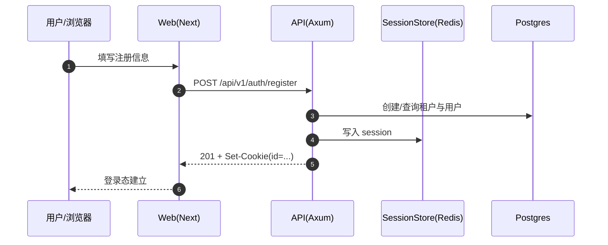
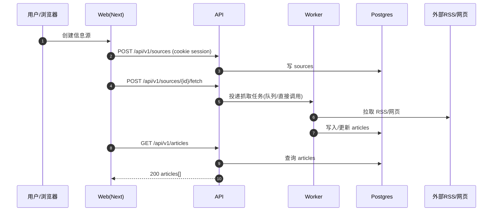

# API Spec（MOD-API / API-001）

> 目标：把当前 Rust API（`crates/law-eye-api`）的接口契约固化为“可商业化交付”的 OpenAPI 合约，并建立回归门禁避免漂移。
>
> 范围：本 Spec 覆盖 HTTP API（`/api/v1/*`）、认证方式（Session Cookie）、错误码/错误体规范、以及 OpenAPI 发布与回归验证策略。

---

## 1. 基础约定（Base）

### 1.1 Base Path 与版本
- **API Base Path**：`/api/v1`
- **健康检查**：`/health/*`
- **OpenAPI JSON**：`/api-docs/openapi.json`
- **Swagger UI**：`/api-docs/swagger-ui`

版本策略（最小要求）：
- **v1 语义**：同一路径/方法下，已发布字段不删除；新增字段必须向后兼容（可选/有默认）。
- **破坏性变更**：只能通过新版本（例如 `/api/v2`）或新增端点实现；旧端点标记 deprecated 并保留迁移窗口。

### 1.2 认证与授权（AuthN/AuthZ）

当前主认证方式：
- **Session Cookie**：Cookie 名为 `id`（由 `tower-sessions` 生成/验证）
- OpenAPI 中的 Security Scheme 名称统一为：`session`

授权约定：
- **默认拒绝**：除 `/api/v1/auth/*` 外，`/api/v1/*` 必须要求已登录会话（由 `RequireAuth` middleware 执行）。
- 角色/权限：在 OpenAPI 中至少标注“需要 session”；细粒度 RBAC 若存在需在描述中明确（本任务不强制落到每个 permission 字段）。

### 1.3 错误返回（统一错误体）

所有非 2xx 响应（除极少数 raw/stream）都应返回统一错误体：

```json
{
  "error": "Human readable message",
  "code": "VALIDATION_ERROR | UNAUTHORIZED | FORBIDDEN | NOT_FOUND | CONFLICT | RATE_LIMITED | SERVICE_UNAVAILABLE | INTERNAL_ERROR | BAD_REQUEST",
  "request_id": "optional string",
  "details": {}
}
```

要求：
- `code` 必须稳定（可用于前端与告警规则匹配）
- `request_id` 若请求链路存在则必须透传（便于排障）
- `details` 仅用于补充结构化信息，禁止放敏感数据/密钥

---

## 2. OpenAPI 合约（Interface Contract）

### 2.1 合约来源
- 合约由 Rust 端使用 `utoipa` 从 handler 注解生成（`crate::openapi::ApiDoc`）。
- OpenAPI 必须包含：
  - `components.securitySchemes.session`（Cookie `id`）
  - `/api/v1/auth/*` 端点（register/login/logout/me）
  - 关键业务端点（articles/sources/search/users/apikeys/knowledge/feedbacks/categories/ai/objects）

### 2.2 稳定性门禁（必须满足）

OpenAPI 生成必须满足以下不变量（用于回归测试）：
- 可以被序列化为 JSON（`serde_json::to_value(ApiDoc::openapi())` 不失败）
- `paths` 至少包含：
  - `/api/v1/auth/login`
  - `/api/v1/articles`
  - `/api/v1/search`
- `components.securitySchemes` 包含 `session`
- 受保护路由（例如 `/api/v1/articles`）至少在一个操作上声明 `security: [{ "session": [] }]`

---

## 3. 关键数据流（Mermaid 序列图）

### 3.1 注册/登录（Session Cookie）



### 3.2 信息源抓取（Source → Fetch → Articles）



---

## 4. 可靠性与幂等（Resilience）

### 4.1 超时/重试
- 外部依赖（RSS/AI/ObjectStorage）必须设置显式超时；重试必须有上限与退避（避免雪崩）。
- 5xx/网络抖动：客户端（E2E）允许重试，但服务端不得无限重试造成阻塞。

### 4.2 幂等
- 创建类接口（如创建 source、创建 apikey）若存在业务唯一约束，应返回 409 并保持返回体稳定。
- 触发类接口（如 fetch/backfill）必须具备“重复调用安全”（重复触发不会产生不可控副作用）。

---

## 5. 验收标准（API-001）

- OpenAPI 能稳定生成并通过回归测试（不变量满足）
- Swagger UI 在本地可访问（`/api-docs/swagger-ui`）
- 不修改业务行为的前提下，完善缺失的 OpenAPI 元信息/注解（最小必要改动）

