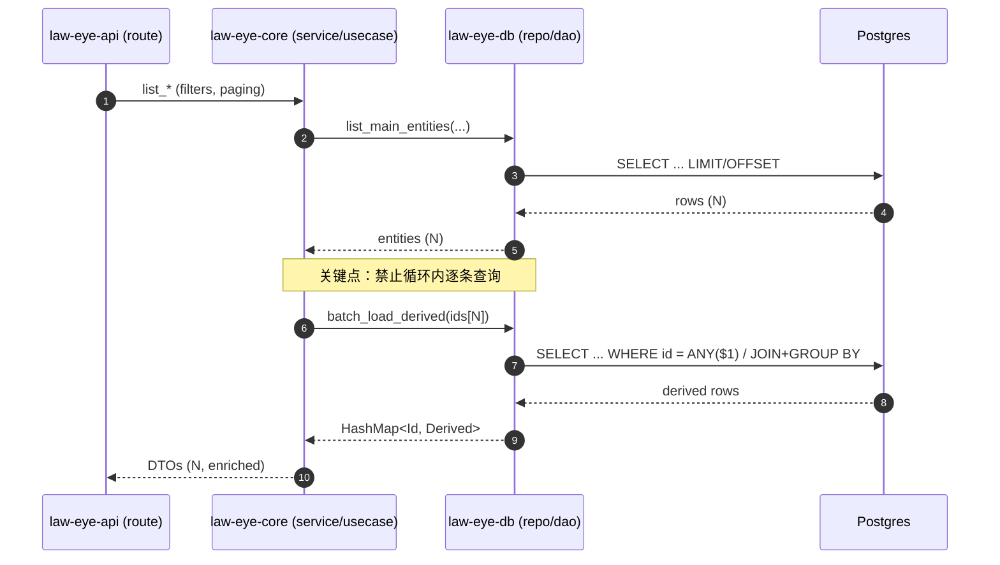

# CORE-001：识别并修复潜在 N+1 查询路径（Spec）

## 1. 背景与问题陈述

当前系统已具备可运行的 E2E 与 Monkey 门禁，但在“列表/聚合类”业务路径中，仍存在潜在 **N+1 查询** 风险：当返回 N 条记录时，代码可能在循环中为每条记录额外触发 1~k 次数据库查询，导致：

- P95/P99 延迟随 N 线性增长（不可预测、不可商业化 SLA）
- 在并发下放大 DB 连接占用，触发级联超时（进而影响 E2E 稳定性）
- 资源成本不可控（云部署成本飙升）

该任务要求以“取证式”方式定位 N+1 热点，并以 **JOIN / 批量查询 / 预加载** 形式消除循环内查询。

## 2. 范围（Scope）

**代码范围**
- `crates/law-eye-core`：领域服务/用例（Usecase），负责组合数据并返回 DTO
- `crates/law-eye-db`：数据访问层（Repository/DAO），负责执行 SQL
- 如有必要：`crates/law-eye-api` 中对服务调用处的拼装逻辑（只做最小改动）

**业务范围（候选热路径）**
- 任何“列表 + 衍生字段”场景：例如列表中需要附带关联对象统计/状态/标签等
- 任何“分页查询”场景：尤其是 `LIMIT/OFFSET` + 关联聚合字段

> 注：具体热路径以“代码取证”结果为准（见 §4）。

## 3. 接口契约（Interface Contracts）

为避免 N+1，Repository 必须提供“批量能力”，禁止上层在循环内逐条查询。

### 3.1 Repository 期望能力（概念契约）

以“主实体列表 + 关联派生数据”为例：

- 输入：`Vec<Id>`（主实体 id 列表）
- 输出：`HashMap<Id, Derived>`（按 id 聚合后的派生数据）
- 性能：单次批量查询返回全部派生数据；不得依赖循环调用

**允许的实现方式**
- `JOIN` / `LEFT JOIN` + `GROUP BY`
- `WHERE id = ANY($1)`（批量参数）
- 子查询/CTE 聚合后再 JOIN

**禁止的实现方式**
- `for item in items { repo.get_x(item.id).await }`
- `items.iter().map(|i| repo.get_x(i.id))` 的并发 fan-out（仍是 N+1，只是更快打爆 DB）

### 3.2 兼容性要求

- 任何接口变更必须保持向后兼容（如：新增方法并在上层替换调用）
- 领域层返回结构保持不变（除非确有业务缺陷需要修正，并配套 E2E 覆盖）

## 4. 数据流（Data Flow）

## 5. 韧性策略（Resilience）

数据库属于强一致依赖，但仍需具备可控失败模式：

- 超时：对“聚合/批量查询”设置合理上限（如驱动层或 SQL `statement_timeout`），避免雪崩
- 错误处理：将 DB 错误转换为具备业务语义的错误码（保持现有错误码体系一致）
- 幂等性：本任务不引入写操作；读路径天然幂等
- 重试：读路径默认不做应用层重试（避免放大 DB 压力）；如上层已有全局重试，必须确保上限与抖动

## 6. 验收标准（Acceptance Criteria）

### 6.1 查询复杂度门槛

在“列表返回 N 条”场景下：

- DB 查询次数必须是 **O(1)**（常数次：主查询 + 0~2 次批量/聚合查询）
- 禁止出现“随 N 增长”的查询次数（即 N+1）

### 6.2 可观测性（取证需要）

- 在关键热路径上补充结构化日志或 metrics（至少能证明已消除循环查询）
- 输出应包含：`request_id`（如有）、实体数量、批量查询 ids 数量

### 6.3 回归验证（必须全部通过）

- `cargo test --workspace`
- `bash scripts/no-dockerhub/e2e.sh --name <new-run>`（包含 E2E + API/Web monkey 门禁）

## 7. 非目标（Non-Goals）

- 不在本任务内引入新的缓存层（Redis Cache）作为“掩盖 N+1”的手段
- 不做 schema 迁移（除非确证无法避免且必须；如需迁移，必须先征求确认）

