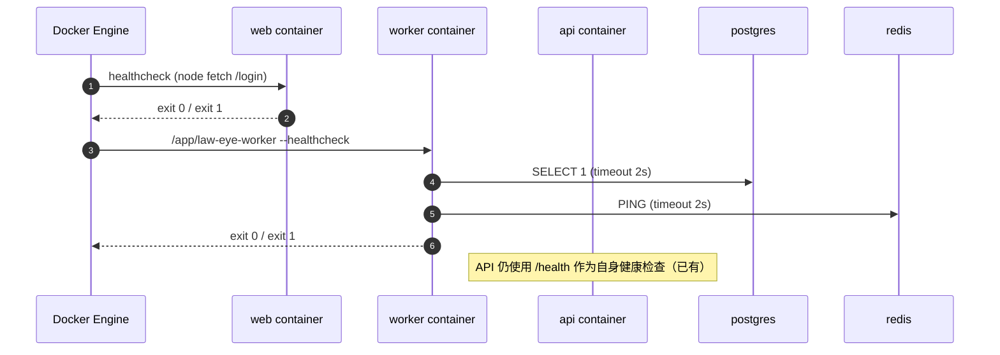

# INFRA-002：Compose 健康检查补全（web/worker）与“全服务 healthy”硬门槛对齐（Spec）

## 1. 背景与问题陈述

当前 `docker-compose.yml` 中：

- `postgres/redis/minio/api` 已具备 healthcheck，`docker compose ps` 可稳定显示 `(healthy)`。
- `web/worker` 缺少 healthcheck，导致“全服务 healthy”的商业门槛无法被 **自动化验证**（compose 只能显示 `Up`，无法区分“可用”与“卡死/自旋/失联”）。

本任务目标：补齐 `web/worker` 的健康检查，使得 `docker compose ps` 可以对 **所有核心服务** 输出明确的健康状态，并提供可复现的验证口径。

## 2. 范围（Scope）

**涉及**
- `docker-compose.yml`：为 `web/worker` 增加 healthcheck，并与 `depends_on`/restart policy 协调
- `crates/law-eye-worker/src/main.rs`：实现 `--healthcheck` 模式（快速、自包含、可用于容器 healthcheck）

**不涉及**
- 新增独立的 worker HTTP 服务（避免引入额外暴露面）
- 改动数据库 schema / 迁移

## 3. 接口契约（Interface Contracts）

### 3.1 Web 健康检查

- 目标：确认 Next.js runtime 已启动并能对外提供 HTTP 200
- 探针：容器内 `GET http://127.0.0.1:8849/login`
- 成功标准：HTTP 响应 `ok`（2xx）即认为健康

### 3.2 Worker 健康检查

Worker 以 CLI 模式提供健康检查：

```text
/app/law-eye-worker --healthcheck
```

成功标准：
- 能加载配置（env/config/vault）
- 在 2s 超时内完成：
  - Postgres `SELECT 1` 成功
  - Redis `PING` 成功

失败标准：
- 任一依赖连接/请求超时或失败 → 进程退出码非 0

## 4. 数据流（Data Flow）



## 5. 韧性策略（Resilience）

- healthcheck 必须 **快速失败**（timeout ≤ 3s），避免健康检查本身导致资源放大
- healthcheck 必须 **不产生写入**（只读探测），避免对业务数据造成污染
- `start_period` 给服务冷启动留缓冲（尤其 web build/启动）

## 6. 验收标准（Acceptance Criteria）

- `docker compose up -d --build` 可启动成功
- `docker compose ps` 显示：
  - `postgres/redis/minio/api/web/worker` 均为 `(healthy)`
- 回归门禁：
  - `cmd.exe /c "cd /d D:\\Desktop\\LawSaw\\apps\\web && pnpm test"` ✅
  - `cargo test --workspace` ✅
  - `bash scripts/no-dockerhub/e2e.sh --name <new-run> --web-mode prod` ✅（E2E + Monkey）

