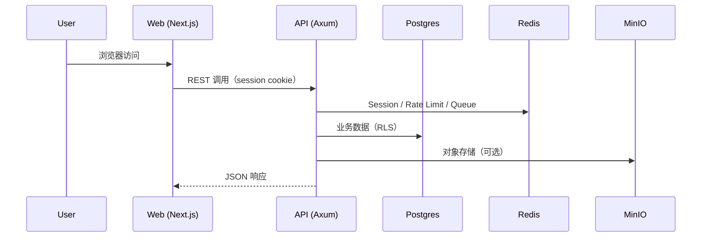
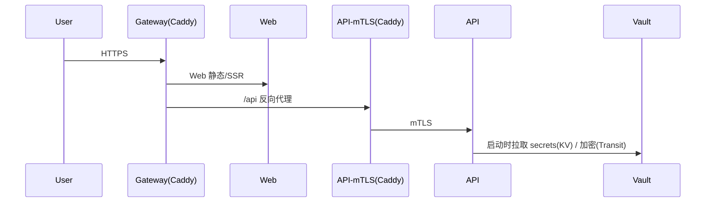

# MOD-INFRA 规格说明（Spec）— Compose / 容器 / Secrets

Spec ID：SPEC-INFRA-001  
状态：DRAFT（实施中）  
目标：将当前仓库的容器与 compose 运行方式提升到“可商业化交付”的安全与可运维基线。

---

## 1. 范围（In Scope）

- `docker-compose.yml`、`docker-compose.enterprise.yml`
- `Dockerfile.api`、`Dockerfile.worker`、`Dockerfile.web`、`Dockerfile.redis`（以及必要的相关配置）
- 本地 Secrets 注入规范：仅允许 `.env`（不提交），仓库只提交 `.env.example`
- 运行时最小权限：应用容器强制以 **UID 1000** 运行
- 健康检查与依赖关系：所有关键服务必须具备 healthcheck，并在 compose 内通过 `depends_on.condition` 编排

不在本 spec 内（Out of Scope）
- 业务逻辑重构、领域模型调整
- API 契约变更（OpenAPI 的改动属于 MOD-API）

---

## 2. 接口契约（Interface Contracts）

### 2.1 环境变量契约（`.env` / Compose）

| 变量 | 类型 | 必填 | 示例 | 用途 |
|---|---:|:---:|---|---|
| `POSTGRES_PASSWORD` | string | ✅ | `***` | Postgres 密码（compose 必需） |
| `REDIS_PASSWORD` | string | ✅ | `***` | Redis requirepass（compose 必需） |
| `MINIO_ROOT_USER` | string | ✅ | `minioadmin` | MinIO access key（开发可用，生产需更换） |
| `MINIO_ROOT_PASSWORD` | string | ✅ | `***` | MinIO secret key |
| `OPENAI_API_KEY` | string | ❌ | `sk-...` | AI 能力（可选；为空则禁用） |
| `OPENAI_BASE_URL` | string | ❌ | `https://api.openai.com/v1` | OpenAI 兼容网关（可选） |
| `API_HOST_PORT` | int | ❌ | `3001` | API 暴露端口（本地） |
| `WEB_HOST_PORT` | int | ❌ | `8849` | Web 暴露端口（本地） |
| `POSTGRES_HOST_PORT` | int | ❌ | `5435` | Postgres 暴露端口（本地调试） |
| `REDIS_HOST_PORT` | int | ❌ | `6380` | Redis 暴露端口（本地调试） |
| `MINIO_API_PORT` | int | ❌ | `9000` | MinIO API 暴露端口（本地调试） |
| `MINIO_CONSOLE_PORT` | int | ❌ | `9001` | MinIO Console 暴露端口（本地调试） |

### 2.2 容器运行身份契约（UID 1000）

| 服务 | 必须以 UID 1000 运行 | 说明 |
|---|:---:|---|
| `api` | ✅ | 自研二进制，强制 `USER 1000:1000` |
| `worker` | ✅ | 自研二进制，强制 `USER 1000:1000` |
| `web` | ✅ | Node 进程必须非 root（优先使用 uid=1000 的 `node` 用户） |
| `redis` | ✅ | Redis 进程必须非 root（需要 volume 权限初始化） |
| `minio` | ✅ | MinIO 进程必须非 root（需要 volume 权限初始化） |

> 备注：对需要持久化的 volume，采用 “init 服务 chown” 的方式保证 UID 1000 可写。

---

## 3. 数据流（Mermaid）

### 3.1 本地开发/验收链路（Compose）

### 3.2 企业模式（Vault + 网关）

---

## 4. 可靠性策略（Resilience）

- **健康检查**：Postgres/Redis/MinIO/API 必须具备 healthcheck；Worker 依赖 API/Redis/Postgres/MinIO 的健康状态。
- **API healthcheck 实现约束**：为支持 distroless 运行时，API 的 compose healthcheck 采用 `["CMD","/app/law-eye-api","--healthcheck"]`（不依赖 curl/wget）。
- **重启策略**：所有长跑服务 `restart: unless-stopped`。
- **超时**：API 请求超时由应用层配置（已有）；外部依赖（LLM/Vault/S3）超时策略由对应模块（MOD-API/MOD-AI）落地。
- **幂等**：数据库 migration 在启动阶段执行，必须可重复执行且失败时容器退出（由当前实现保证）。

---

## 5. 验收标准（Acceptance Criteria）

1. `docker compose up --build` 成功；所有 healthcheck 通过
2. `docker compose ps` 显示 `api/web/postgres/redis/minio` 均为 healthy
3. compose 文件中不出现任何默认明文密码（MinIO/Redis/Postgres/OpenAI）
4. `api/worker/web/redis/minio` 在容器内进程用户为 UID 1000（可通过 `docker exec id` 验证）
