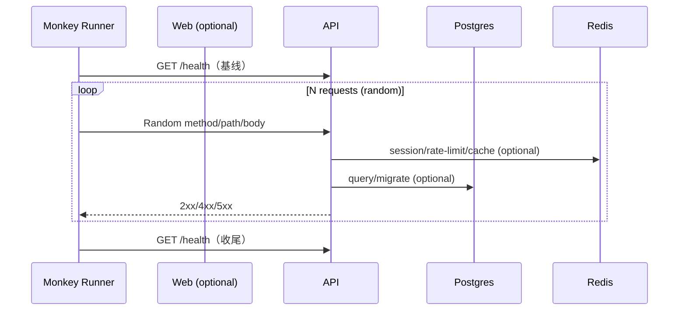

# MOD-QA 规格说明（Spec）— E2E / Monkey / Load

Spec ID：SPEC-QA-002  
状态：FINAL（已实施并验证）  
目标：为 LawSaw 提供“可商业化交付”的系统级验证基线：E2E 用户旅程 + Monkey（混沌/模糊）测试 + 基础负载/延迟检查，并将测试报告落盘到 `prompts/logs/` 作为外部大脑的一部分。

---

## 1. 范围（In Scope）

- E2E：基于 `apps/web` 的 Playwright 测试（关键用户旅程：登录 → 核心动作 → 登出）
  - 覆盖页面：`/`（看板）、`/articles`、`/articles/:id`、`/search`、`/sources`、`/data`、`/analytics`、`/feedback`、`/knowledge`、`/settings`、`/category/:slug`
  - 覆盖能力：RSS 抓取入库、数据管理（发布/归档/删除至少一项）、反馈提交、知识图谱初始化、API Key 生命周期、头像上传（对象存储链路）
- Monkey（Chaos/Fuzz）：针对 API/Web 入口进行随机/畸形输入、超大 payload、快速并发请求的压力注入
- 结果产物：
  - 结构化报告（JSON/纯文本）保存到 `prompts/logs/`
  - 必须在 CI/本地可重复执行（幂等）

不在本 spec 内（Out of Scope）
- 业务逻辑修改（除非为提升可测性/稳定性所必需）
- 生产级全量压测平台（k6/Locust 集群）

---

## 2. 接口契约（Interface Contracts）

### 2.1 Monkey API 脚本契约

脚本：`scripts/monkey/api_monkey.py`

输入（CLI）
- `--base-url`（string，默认：`http://127.0.0.1:3001`）
- `--requests`（int，默认：`500`）
- `--concurrency`（int，默认：`20`）
- `--timeout-ms`（int，默认：`1500`）
- `--max-payload-kb`（int，默认：`256`）
- `--p95-threshold-ms`（int，默认：`500`；`0` 表示禁用门槛）
- `--max-5xx`（int，默认：`0`）
- `--max-net-errors`（int，默认：`0`）
- `--max-timeouts`（int，默认：`0`）
- `--report-json`（string，可选；默认：若仓库存在 `prompts/logs/` 则写入 `prompts/logs/monkey_api_report.json`）
- `--seed`（int，可选；提供则可复现）

输出（stdout）
- 汇总统计：总请求数、成功数、4xx 数、5xx 数、超时/连接错误数、耗时、QPS（估算）
- 延迟分位数：p50/p90/p95/p99（ms）
- 产物落盘：会打印 `report_json=<path>`（若启用 report）

退出码
- `0`：通过（满足门禁阈值，且测试前后健康检查均通过）
- `2`：参数错误
- `3`：测试前健康检查失败
- `4`：测试后健康检查失败
- `5`：连接级错误超过阈值（timeouts/net_errors）
- `6`：SLA 门禁阈值违反（p95/http_5xx 等）

### 2.2 Monkey Web 脚本契约

脚本：`scripts/monkey/web_monkey.py`

输入（CLI）
- `--base-url`（string，默认：`http://127.0.0.1:8849`）
- `--requests`（int，默认：`300`）
- `--concurrency`（int，默认：`20`）
- `--timeout-ms`（int，默认：`1500`）
- `--p95-threshold-ms`（int，默认：`500`；`0` 表示禁用门槛）
- `--max-5xx`（int，默认：`0`）
- `--max-net-errors`（int，默认：`0`）
- `--max-timeouts`（int，默认：`0`）
- `--report-json`（string，可选；默认：若仓库存在 `prompts/logs/` 则写入 `prompts/logs/monkey_web_report.json`）
- `--seed`（int，可选；提供则可复现）

输出（stdout）
- 汇总统计：总请求数、2xx/3xx/4xx/5xx、超时/连接错误数、耗时、QPS（估算）
- 延迟分位数：p50/p90/p95/p99（ms）
- 产物落盘：会打印 `report_json=<path>`（若启用 report）

退出码
- `0`：通过（满足门禁阈值，且测试前后基线请求均通过）
- `2`：参数错误
- `3`：测试前基线请求失败
- `4`：测试后基线请求失败
- `5`：连接级错误超过阈值（timeouts/net_errors）
- `6`：SLA 门禁阈值违反（p95/http_5xx 等）

### 2.3 E2E 脚本契约

- `apps/web` 通过 `pnpm -C apps/web e2e` 执行 Playwright
- 必须允许通过环境变量配置基址：
  - `E2E_BASE_URL`（例如：`http://127.0.0.1:8849`）
- 需要提供可被 worker 访问的 RSS fixture：
  - `E2E_RSS_URL`（推荐：`http://rss-fixture:8000/rss.xml`，配合 `docker compose --profile e2e up -d`）
- 兼容运行时注入文件（用于 Windows/WSL interop 等 env 透传不稳定场景）：
  - `tmp/e2e-env.json`：支持 `base_url` / `rss_url`
- 可靠性策略：
  - 允许对 `register/me` 等易受启动抖动影响的步骤做有限重试（仅限 5xx/网络错误/429）
  - 对关键写操作（创建源、触发抓取、创建 API key、上传头像）必须检查结果并轮询最终状态（避免“点击成功但后端未落地”）

---

## 3. 数据流（Mermaid）

### 3.1 Monkey API（本地 compose）

---

## 4. 可靠性策略（Resilience）

- 超时：每个请求必须设置 `timeout-ms`，避免测试本身被卡死
- 并发：通过线程池/并发任务实现；失败需可统计与可诊断
- 幂等：脚本不应依赖外部持久状态；如需写入，必须写入可回收的测试数据或仅调用只读/认证接口
- 不确定性控制：支持 `--seed` 固定随机源，便于复现问题

---

## 5. 验收标准（Acceptance Criteria）

1. `docker compose up --build -d` 可拉起全栈且 `api` 为 healthy
2. `python3 scripts/monkey/api_monkey.py ...` 通过（exit 0），并生成 `prompts/logs/monkey_api_report.json`
3. `python3 scripts/monkey/web_monkey.py ...` 通过（exit 0），并生成 `prompts/logs/monkey_web_report.json`
4. Monkey 门禁阈值生效（默认：`p95<=500ms`、`5xx==0`、`timeouts==0`、`net_errors==0`）
5. Web `pnpm -C apps/web test` 通过（typecheck + lint）
6. E2E 全套通过：`pnpm -C apps/web e2e`（覆盖：Analytics/Data/Feedback/Knowledge/Settings/Category + 主用户旅程闭环）
