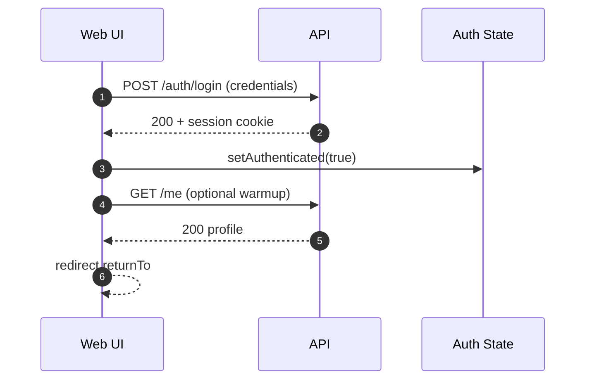
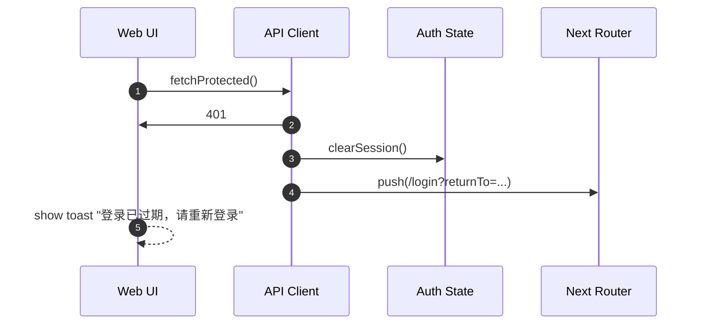

# WEB-001：前端关键路径与错误恢复体验（Spec）

## 1. 背景与问题陈述

当前项目已具备可运行的 Playwright E2E 与 Monkey 门禁，但“商业可用”的前端还必须具备 **可预测的错误恢复** 与 **登录态一致性**：

- 用户会遇到 401（会话过期/被登出）、403（权限不足）、5xx（服务端故障）、网络抖动/断网、慢请求超时等真实场景
- 若前端缺少统一错误处理，会出现：白屏、静默失败、无限重试、状态错乱（UI 显示已登录但接口全 401）
- 在 E2E 通过的情况下，仍可能存在“失败恢复路径未覆盖”的商业风险

本任务目标：在不引入“空壳”逻辑的前提下，建立统一的前端错误/鉴权处理策略，并用 E2E 覆盖关键失败恢复路径。

## 2. 范围（Scope）

**代码范围**
- `apps/web/src/**`：API 客户端封装、鉴权状态、错误提示与重试策略、关键页面（受保护路由）
- `apps/web/e2e/**`：Playwright 覆盖（失败恢复、登出、权限不足、网络断连）

**不在本任务范围**
- 后端认证/授权模型重构（除非 E2E 明确失败且必须修复）
- 引入新的 UI 库（保持现有 Biome/React Query/Next 生态）

## 3. 接口契约（Interface Contracts）

### 3.1 HTTP 错误语义（前端消费约定）

前端将后端响应归一为以下语义（不依赖单一路由的字符串错误）：

- **401 Unauthorized**：会话失效/未登录
  - 行为：清理本地会话状态 → 跳转到 `/login` → 保留 `returnTo`（原路径）
- **403 Forbidden**：已登录但无权限
  - 行为：展示“权限不足”提示（可返回上一页/首页），不得循环重试
- **429 Too Many Requests**：限流
  - 行为：提示稍后重试；对写操作禁用自动重试；读操作可少量重试（带抖动）
- **5xx**：服务端故障
  - 行为：展示错误状态（含重试按钮）；对读操作允许有限重试；不得造成无限重试/刷屏
- **网络错误/超时**（fetch 失败、Abort）
  - 行为：展示“网络异常/请求超时”；提供重试；不得卡死页面

### 3.2 类型与校验

- 对关键响应（如 session/profile）使用严格 TypeScript 类型，不使用 `any`
- 对不可信字段（如富文本/HTML）必须在渲染前进行净化（现有 `dompurify` 继续使用）

## 4. 数据流（Data Flow）

### 4.1 登录与会话恢复

### 4.2 401 统一恢复（关键）

## 5. 韧性策略（Resilience）

- **超时**：前端请求默认超时（例如 10s），避免永远 pending
- **重试**：
  - GET/列表：最多 2 次指数退避（带抖动）
  - POST/写入：默认不自动重试（防止重复提交）；需要幂等时通过显式 `idempotencyKey`
- **幂等**：对可重复提交的操作，在 UI 层生成 `idempotencyKey`（如 uuid），并随请求发送（若后端已支持则启用；否则仅保留接口设计，避免空壳）

## 6. E2E 验收（必须覆盖）

Playwright 必须覆盖以下路径：

1. 未登录访问受保护页面 → 重定向登录（已覆盖则增强断言：returnTo 正确）
2. 登录后访问关键页面 → 正常使用
3. **会话失效**：登录后模拟 401（清 cookie/拦截 API）→ 自动回到登录页 + UI 提示
4. **权限不足**：模拟 403 → 展示明确提示且不重试
5. **网络断连/超时**：模拟 fetch 失败 → 页面可恢复（重试按钮可用，不白屏）

## 7. 验收标准（Acceptance Criteria）

- `pnpm -C apps/web test` 通过（typecheck + biome lint）
- `pnpm -C apps/web e2e` 通过
- `bash scripts/no-dockerhub/e2e.sh --name <new-run>` 通过（E2E + Monkey 门禁）
- 关键失败路径具备可观测的用户提示（toast/错误页），且不会造成无限重试/死循环

